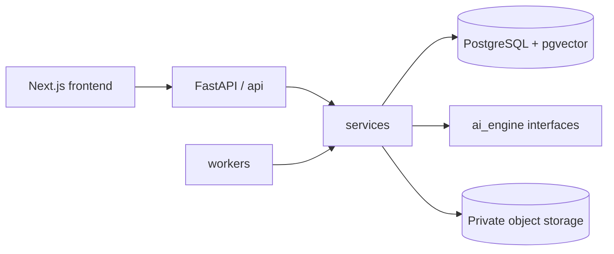

# Flare

Flare — база знаний для стартапов: команда собирает заметки, ссылки, файлы и
аудио, а ИИ находит связи и формирует проверяемые инсайты со ссылками на
конкретные источники.

Это единый монорепозиторий продукта:

```text
frontend/     Next.js-интерфейс
backend/      FastAPI, PostgreSQL, pgvector, миграции и тесты
compose.yaml  локальный запуск всего стека
```

## Что объединено

- Интерфейс импортирован из `fedocc/flare-frontend` на коммите
  `dd2e65b75ac8ab916db03e8986ce490b0a4d3384`.
- Структура бэкенда адаптирована из пустого архитектурного каркаса
  `nikepf/startup_insight` на коммите
  `45057fbd9b5ef427a79659c63a0b06aa57a5c41a`.
- Рабочая SQL-схема, RLS, миграции, тесты и FastAPI-основа перенесены из
  первоначального Flare backend.

Подробности происхождения файлов перечислены в [THIRD_PARTY.md](THIRD_PARTY.md).

## Архитектура



Backend разделён на `api`, `services`, `models`, `ai_engine` и `workers`.
PostgreSQL хранит команды, документы, версии, текстовые chunks, embeddings,
инсайты, citations, журнал продуктовых действий и состояние подключений. Большие
оригинальные файлы будут храниться отдельно в приватном object storage.

Готовые версии документов неизменяемы: после обновления старый инсайт продолжает
ссылаться на тот снимок текста, по которому он был создан. Все пользовательские
таблицы изолированы по `workspace_id` с помощью составных внешних ключей и RLS.

## Запуск всего проекта

Нужен Docker Compose:

```sh
cp .env.example .env
docker compose up --build
```

Compose применяет Alembic отдельным одноразовым сервисом `migrate`; backend
получает только ограниченный `DATABASE_URL` роли `flare_app`. AI-worker вынесен
в отдельный opt-in profile: `worker-configure` задаёт пароль его роли из
`WORKER_PASSWORD`, а сам worker получает `GROQ_API_KEY`. Без этого профиля
регистрация и сохранение источников доступны, но очередь ждёт обработчика.
Пароли из `.env.example` предназначены только для локальной разработки.

Чтобы автоматически обрабатывать очередь ИИ, укажите `GROQ_API_KEY` в `.env`
и запустите AI-профиль:

```sh
docker compose --profile ai up --build
```

Он создаёт отдельный worker с ролью `flare_worker`; API его пароль и owner-URL
не получает. Один worker достаточен для старта. При росте очереди можно безопасно
запустить несколько одинаковых процессов: `docker compose --profile ai up --scale worker=2`.

После запуска:

- frontend: http://localhost:3000
- API docs: http://localhost:8000/docs
- backend health: http://localhost:8000/health
- database readiness: http://localhost:8000/ready

### PostgreSQL в Yandex Cloud без Docker

Frontend и backend можно запускать локально, а базу хранить в Yandex Managed
Service for PostgreSQL. Нужны PostgreSQL 17, пользователи `flare_owner`,
`flare_app`, `flare_worker`, включённый через панель pgvector и TLS-подключение
к порту `6432`. Секреты разделены между шаблонами
`.env.yandex.migrate.example`, `.env.yandex.api.example` и
`.env.yandex.worker.example`; каждый процесс получает свой файл через
`FLARE_DOTENV_PATH`. Пошаговая настройка, проверка реального managed-кластера и
откат описаны в
[инструкции по Yandex Managed PostgreSQL](backend/docs/yandex-managed-postgresql.md).

Docker Compose запускает первый сквозной сценарий с настоящей БД: заметка,
созданная через Capture, отправляется в FastAPI, атомарно сохраняется в
`documents`, `document_versions` и `chunks`, появляется в Vault и остаётся там
после обновления страницы. API предоставляет `POST /items`, `GET /items`,
`GET /items/{id}` и `DELETE /items/{id}`.

При первом входе зарегистрируйтесь: сервер атомарно создаёт пользователя,
один workspace и owner membership. Последующие входы используют отзываемую
HttpOnly cookie-сессию. Workspace и права определяет сервер; доступ к данным
дополнительно ограничен PostgreSQL RLS. Переключения workspace пока нет.

В production подтверждение email включено по умолчанию и требует HTTPS
`APP_PUBLIC_URL`, `SMTP_URL` и `EMAIL_FROM`. До подтверждения сессия может
открывать только `/auth/me`, logout и endpoints подтверждения/повторной отправки;
Items, Vault, Analyze и Flares закрыты. Локальный Compose явно отключает эту
проверку. Для ручной проверки установите `EMAIL_VERIFICATION_REQUIRED=true`:
backend напечатает localhost-ссылку, не передавая SMTP или его секреты во
frontend/worker.

Compose по умолчанию использует `FLARE_ENV=development` и
`FLARE_DEV_MODE=false`. Браузер обращается к `/api` на своём origin; Next.js
проксирует запросы в FastAPI. Для production задайте `FLARE_ENV=production`,
точный HTTPS origin в `CORS_ORIGINS` и настройте TLS перед Next.js. Подробности
сессий, конфигурации и ограничений — в [backend/README.md](backend/README.md).
Capture принимает заметки, а также CSV, TXT и Markdown: браузер передаёт
ограниченный текст файла, сервер атомарно сохраняет его как документ, версию и
chunks, а затем ставит анализ в durable-очередь. Один и тот же файл не создаёт
дубликат в пределах workspace. URL и аудио пока сохраняются как источники; их
загрузка и транскрибация остаются отдельными этапами.

Flares загружаются из БД. Явная кнопка Analyze остаётся для запуска отдельного
ограниченного прогона, а новые заметки и текстовые импорты добавляют свою работу
в очередь автоматически. `activity_events` считает действия без текста заметок
или содержимого файлов; owner может проверить состояние очереди через
`GET /ops/queue` и сначала безопасно просмотреть очистку через
`POST /ops/queue/maintenance` с `dry_run: true`.

В Sources реализован безопасный GitHub App flow: одноразовое состояние,
проверка владельца установки, выбор репозитория, хранение выбранного
репозитория и отключение. Это подключает репозиторий, но ещё не копирует его
содержимое в базу: импорт содержимого GitHub — следующий отдельный этап.

Проверить сохранение можно через интерфейс: создайте Note, откройте Vault и
обновите страницу. Запись также видна напрямую в PostgreSQL:

```sh
docker compose exec db psql -U postgres -d flare -c \
  "SELECT d.title, v.state, c.content FROM documents d JOIN document_versions v ON v.id = d.current_version_id JOIN chunks c ON c.document_version_id = v.id WHERE d.deleted_at IS NULL ORDER BY d.created_at DESC;"
```

## Проверки

```sh
python -m pip install -e 'backend[dev]'
pytest -q backend/tests
npm --prefix frontend ci
npm --prefix frontend run lint
npm --prefix frontend run build
```

GitHub Actions выполняет обе группы проверок. Backend job поднимает PostgreSQL
17 с pgvector и дважды применяет миграции, проверяя повторный запуск. Режим
Yandex в CI эмулирует подготовку пользователей и расширения control plane, но
не заменяет smoke-тест на настоящем Yandex Managed PostgreSQL.

## Документация

[План реализации MVP](docs/MVP_IMPLEMENTATION_PLAN.md),
[исследование AI-моделей](docs/AI_MODELS.md),
[проект БД](backend/docs/database.md),
[Yandex Managed PostgreSQL](backend/docs/yandex-managed-postgresql.md),
[слои бэкенда](backend/docs/architecture.md),
[контракт frontend](frontend/docs/API_CONTRACT.md).
