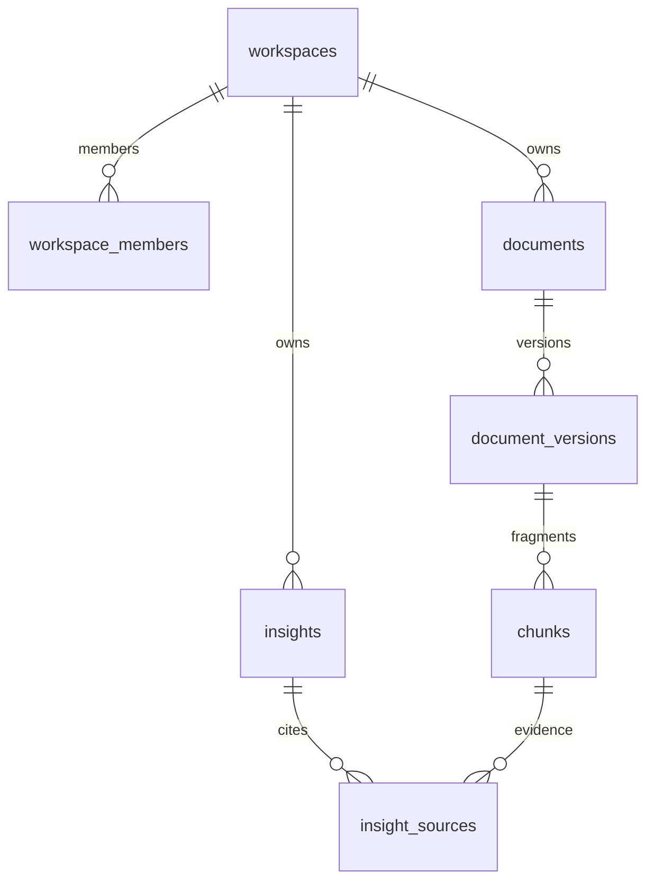

# Flare

База знаний для стартапов: команда собирает материалы, а ИИ помогает находить выводы и показывает источники.

Это стартовый репозиторий БД и Python-бэкенда. Здесь есть SQL-схема, миграция Alembic, PostgreSQL + pgvector для локальной разработки, каркас FastAPI и проверки изоляции команд. Загрузка файлов, авторизация, обработчик документов и генерация инсайтов — следующие этапы; сейчас API предоставляет только `/health` и `/ready`.

## Как устроены данные

Одна команда — один `workspace`. Документ имеет версии; каждая версия разбивается на фрагменты (`chunks`). ИИ получает найденные фрагменты и сохраняет инсайт со ссылками на них. Старый инсайт продолжает ссылаться на ту версию, которую видел ИИ.



| Где | Что храним |
| --- | --- |
| PostgreSQL | Команды, доступ, карточки документов, версии, текст фрагментов, инсайты и ссылки |
| pgvector в той же БД | Векторы фрагментов для поиска по смыслу |
| Приватное файловое хранилище, подключим позже | Оригинальные PDF, изображения, аудио и другие файлы; в БД только ключ объекта |

Подробности и границы реализации — в [проекте БД](docs/database.md). Сама схема — [db/schema.sql](db/schema.sql).

## Локальный запуск

Нужны Python 3.11+ и Docker Compose. Команды выполняются из корня репозитория.

```sh
cp .env.example .env
docker compose up -d --wait
python3 -m venv .venv
source .venv/bin/activate
python -m pip install -e '.[dev]'
alembic upgrade head
uvicorn app.main:app --reload
```

Открой http://127.0.0.1:8000/docs. `/health` проверяет API, `/ready` — подключение к БД с ограниченной ролью и наличие начальной схемы. Локальная БД доступна только на `127.0.0.1`.

`DATABASE_URL` использует ограниченную роль `flare_app`, а `MIGRATION_DATABASE_URL` — администратора для изменения схемы. Пароли из `.env.example` предназначены только для локальной разработки; `.env` исключён из Git. Скрипт `db/init-role.sql` выполняется автоматически при первом создании Docker-тома. Изменение пароля в `.env` не меняет пароль уже созданной роли.

## Проверки

После запуска БД и применения миграции:

```sh
pytest -q
```

Тесты БД используют `TEST_DATABASE_URL`, отдельные транзакции с откатом и проверяют операции от `flare_app`. Запускай их на локальной или выделенной тестовой БД. Без `TEST_DATABASE_URL` интеграционные тесты пропускаются; HTTP-проверки можно запустить отдельно: `pytest -q tests/test_health.py`.

GitHub Actions поднимает PostgreSQL 17 с pgvector, создаёт роль, применяет миграцию и запускает тесты. Повторный `alembic upgrade head` также проверяется. Docker-тег фиксирует основную версию PostgreSQL; перед production зафиксируйте digest образа и версии зависимостей после проверки в вашей среде.

## Что делать дальше

1. Выбрать авторизацию и реализовать проверку членства в команде на сервере.
2. Добавить API создания документов и приватное файловое хранилище.
3. Сделать worker: извлечение текста → фрагменты → embeddings → публикация готовой версии.
4. Добавить поиск по текущим документам команды, затем генерацию инсайтов с проверяемыми ссылками.

Сначала доведите один сценарий: загрузить заметку → найти фрагмент → получить инсайт с источником. Выбор облака, embedding-модели и LLM остаётся открытым.

