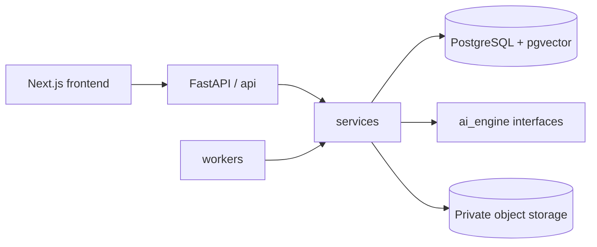

# Flare

Flare — база знаний для стартапов: команда собирает заметки, ссылки, файлы и
аудио, а ИИ находит связи и формирует проверяемые инсайты со ссылками на
конкретные источники.

Это единый монорепозиторий продукта:

```text
frontend/     Next.js-интерфейс
backend/      FastAPI, PostgreSQL, pgvector, миграции и тесты
compose.yaml  локальный запуск всего стека
```

## Что объединено

- Интерфейс импортирован из `fedocc/flare-frontend` на коммите
  `dd2e65b75ac8ab916db03e8986ce490b0a4d3384`.
- Структура бэкенда адаптирована из пустого архитектурного каркаса
  `nikepf/startup_insight` на коммите
  `45057fbd9b5ef427a79659c63a0b06aa57a5c41a`.
- Рабочая SQL-схема, RLS, миграции, тесты и FastAPI-основа перенесены из
  первоначального Flare backend.

Подробности происхождения файлов перечислены в [THIRD_PARTY.md](THIRD_PARTY.md).

## Архитектура



Backend разделён на `api`, `services`, `models`, `ai_engine` и `workers`.
PostgreSQL хранит команды, документы, версии, текстовые chunks, embeddings,
инсайты и citations. Оригинальные файлы будут храниться отдельно в приватном
object storage.

Готовые версии документов неизменяемы: после обновления старый инсайт продолжает
ссылаться на тот снимок текста, по которому он был создан. Все пользовательские
таблицы изолированы по `workspace_id` с помощью составных внешних ключей и RLS.

## Запуск всего проекта

Нужен Docker Compose:

```sh
cp .env.example .env
docker compose up --build
```

После запуска:

- frontend: http://localhost:3000
- API docs: http://localhost:8000/docs
- backend health: http://localhost:8000/health
- database readiness: http://localhost:8000/ready

Docker Compose запускает первый сквозной сценарий с настоящей БД: заметка,
созданная через Capture, отправляется в FastAPI, атомарно сохраняется в
`documents`, `document_versions` и `chunks`, появляется в Vault и остаётся там
после обновления страницы. API предоставляет `POST /items`, `GET /items`,
`GET /items/{id}` и `DELETE /items/{id}`.

Для локальной разработки Compose включает фиксированные тестовые workspace и
пользователя; их значения можно переопределить через `.env`. Этот режим нужен
только для запуска на своём компьютере: он не заменяет регистрацию и проверку
JWT. Sources и Insights пока используют демонстрационные данные. Загрузка
бинарных файлов, URL, аудио, workers и AI-провайдеры остаются следующим этапом
интеграции.

Проверить сохранение можно через интерфейс: создайте Note, откройте Vault и
обновите страницу. Запись также видна напрямую в PostgreSQL:

```sh
docker compose exec db psql -U postgres -d flare -c \
  "SELECT d.title, v.state, c.content FROM documents d JOIN document_versions v ON v.id = d.current_version_id JOIN chunks c ON c.document_version_id = v.id WHERE d.deleted_at IS NULL ORDER BY d.created_at DESC;"
```

## Проверки

```sh
python -m pip install -e 'backend[dev]'
pytest -q backend/tests
npm --prefix frontend ci
npm --prefix frontend run lint
npm --prefix frontend run build
```

GitHub Actions выполняет обе группы проверок. Backend job поднимает настоящий
PostgreSQL 17 с pgvector и дважды применяет миграции, проверяя повторный запуск.

Документация: [проект БД](backend/docs/database.md),
[слои бэкенда](backend/docs/architecture.md),
[контракт frontend](frontend/docs/API_CONTRACT.md).
