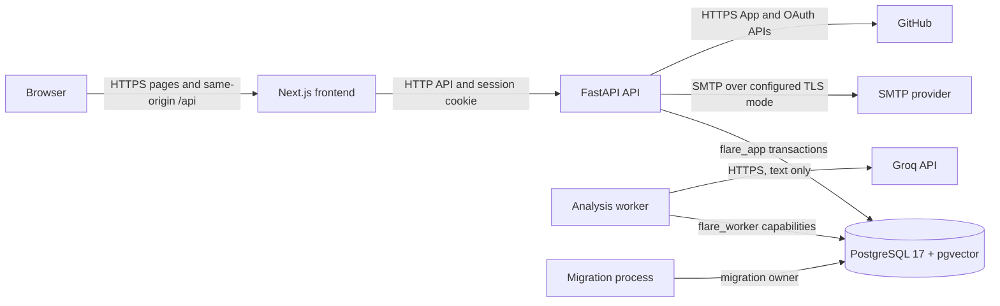
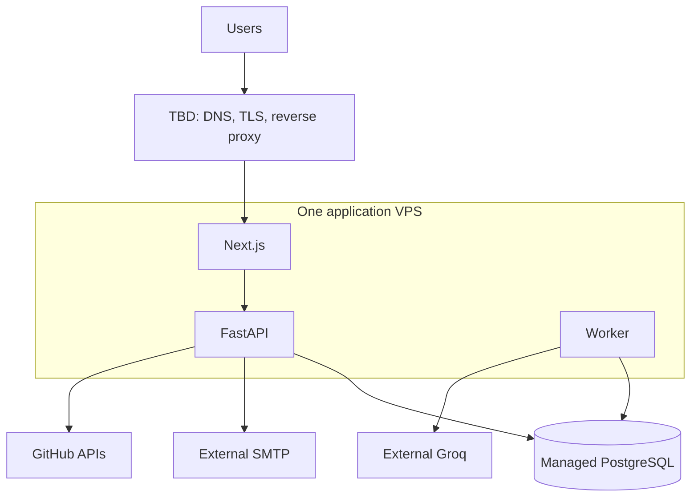

# Flare Architecture

This document describes the repository at migration head `0009`.

Status labels used throughout:

- **Current implementation** — present in `main` and covered by repository tests.
- **Approved release decision** — agreed deployment direction that may still need operational setup.
- **TBD / unresolved** — not implemented or not selected; do not infer a production choice.

## 1. Product and system boundary

**Current implementation.** Flare is a workspace-scoped knowledge application. A
user registers, verifies an email address when verification is enabled, captures
Notes, searches the Vault, explicitly starts Analyze, and reads generated Flares
with links to their supporting Note evidence.

The repository owns the Next.js frontend, FastAPI API, PostgreSQL schema and
PostgreSQL-backed analysis worker. PostgreSQL is the durable source of truth.
Groq performs text analysis and Flare generation. SMTP delivers production
verification mail. GitHub supplies installation, account, and repository metadata
for the connection flow.

**TBD / unresolved.** URL and file ingestion, durable voice transcription,
GitHub activity ingestion, automated synchronization, workspace switching,
invitations, password reset, quota accounting, and scheduled analysis are outside
the current end-to-end product boundary.

## 2. Repository map

**Current implementation.**

| Path | Responsibility |
| --- | --- |
| `frontend/src/app/` | Next.js App Router pages, layouts, redirects, and auth bootstrap |
| `frontend/src/features/` | Capture, Vault, Analyze, Flares, Sources, auth, and settings screens |
| `frontend/src/components/` | Shared shell and UI components |
| `frontend/src/lib/data/` | Typed frontend provider boundary and API/mock adapters |
| `frontend/src/mocks/` | Explicit development demo data |
| `backend/app/api/` | FastAPI HTTP routes and request/response contracts |
| `backend/app/services/` | Auth, Note, GitHub, analysis, and Flare use cases |
| `backend/app/models/` | PostgreSQL transactions, repositories, and job capabilities |
| `backend/app/ai_engine/` | Provider-independent AI contracts, validation, prompts, and Groq adapters |
| `backend/app/workers/` | Durable worker process and polling loop |
| `backend/migrations/` | Linear Alembic schema history |
| `backend/db/` | Self-managed and Yandex-compatible role provisioning |
| `.github/workflows/checks.yml` | Frontend and two-provider backend CI matrix |
| `compose.yaml` | Local PostgreSQL, migration, API, worker, and frontend topology |

## 3. Runtime components

**Current implementation.**

| Component | Runtime role | Credentials and state |
| --- | --- | --- |
| Next.js frontend | Pages, server auth bootstrap, same-origin `/api` proxy, browser UI | No database, Groq, SMTP, or GitHub secrets |
| FastAPI API | Sessions, email verification, Notes, Analyze, Flares, GitHub connection flow | `flare_app` database role; SMTP and GitHub App credentials |
| Analysis worker | Claims extraction and Flare-generation jobs and calls Groq | `flare_worker` database role and `GROQ_API_KEY` |
| Migration process | Applies Alembic migrations and owns privileged schema changes | Migration owner credentials only |
| PostgreSQL 17 + pgvector | Durable users, workspaces, Notes, jobs, Flares, and integration metadata | Separate runtime, worker, and migration roles |
| Groq | External text analysis and Flare generation | Called only by the worker |
| SMTP server | External verification-email delivery | Called only by the API |
| GitHub App APIs | External authorization, installation, and repository listing | Called only by the API |

## 4. Runtime architecture

**Current implementation** is shown with solid arrows. The database placement in
production follows the approved decision below.



## 5. Core Note to Analyze to Flare data flow

**Current implementation.**

1. `POST /items` accepts a Note from a verified owner or editor.
2. One transaction writes `documents`, a ready `document_versions` row, and its
   immutable `chunks`; `documents.current_version_id` points at the published
   version.
3. `POST /analyze` accepts an empty JSON object plus an `Idempotency-Key` UUID.
4. The API selects bounded, recent, ready Note chunks inside the caller's
   workspace. It creates `analysis_runs`, `analysis_jobs`, and pinned
   `analysis_job_sources` atomically.
5. The API returns pending or processing state without calling Groq.
6. The worker claims the analysis job with a lease, loads only the pinned evidence,
   releases the database connection, calls Groq, validates the structured result,
   and finishes the job through a restricted database function.
7. Completion enqueues one `flare_generation_runs` record. The same worker claims
   that stage, calls Groq outside a database transaction, validates source IDs and
   exact quotes, and atomically writes typed `insights` and `insight_sources`.
8. The frontend polls `GET /analysis-runs/{id}` and reloads `GET /flares` when the
   run completes. Evidence links open the matching Note in Vault.

Saving a Note never starts analysis automatically. A valid empty Flare result is a
successful completed run.

## 6. AI pipeline

**Current implementation.** The worker uses the native Groq SDK through interfaces
in `backend/app/ai_engine/`. Text extraction and Flare generation use
`openai/gpt-oss-20b` with low reasoning effort. Configuration validation rejects
other text model profiles. Requests have byte, source, completion-token, transport,
and wall-clock bounds. SDK retries are disabled because the durable worker owns
retry scheduling.

Provider responses are parsed into strict application models. Evidence identifiers
and quotes must match the supplied immutable chunks. Persisted metadata uses an
allowlist; raw prompts, reasoning, private Note bodies, provider error bodies, and
credentials are not persisted as job errors.

**Approved release decision.** The 20B profile is the default text path. The project
model policy reserves 120B for explicit reasoning escalation.

**TBD / unresolved.** No 120B routing or escalation is implemented. A quality set,
quota accounting, production Groq reachability, and live representative acceptance
still need release evidence.

## 7. Durable jobs

**Current implementation.** PostgreSQL is the queue. `analysis_jobs` and
`flare_generation_runs` store status, bounded attempts, availability, lease owner,
lease token, lease expiry, safe error code, and timestamps. Claims are atomic.
Expired leases make interrupted work recoverable. Transient failures use scheduled
exponential backoff with jitter and `Retry-After` support; permanent validation,
configuration, authorization, and source-invalidity failures terminate safely.

`analysis_runs` is the public orchestration record. Its workspace, requesting user,
idempotency key, source snapshot, and pipeline revisions prevent duplicate logical
runs. Worker access is limited to reviewed `SECURITY DEFINER` capabilities; the
worker cannot browse tenant tables directly.

## 8. Authentication and email verification

**Current implementation.** Registration creates an `auth_users` row, one
workspace, owner membership, and an opaque session. Passwords use Argon2id. The
database stores a SHA-256 digest of the random session token. Cookies are HttpOnly,
SameSite=Lax, host-only, and become `Secure` with the `__Host-` name in production.
Sessions have absolute and idle expiry and are revocable on logout.

Production enables email verification by default. Verification tokens are random,
stored only as digests, expire, and are single use. Resend has a cooldown and a
neutral response. An unverified session can access identity, logout, verification,
and resend endpoints; Notes, Vault data, Analyze, Flares, and GitHub integration
require a verified user. Migration `0008` marks pre-existing users verified.

**TBD / unresolved.** The production SMTP provider, sender identity, deliverability
monitoring, bounce handling, password reset, rate limiting, and account recovery
process are not selected or implemented.

## 9. Workspace authorization and RLS

**Current implementation.** The authenticated session determines the user and
initial workspace; the browser cannot submit trusted identity headers. Each
workspace transaction sets `app.workspace_id` and `app.user_id` locally, verifies
membership, and requires owner/editor for writes. Viewer access is read-only.

Tenant tables have enabled and forced PostgreSQL row-level security. Composite keys
and foreign keys prevent cross-workspace relationships. The API connects as the
restricted `flare_app` role without `SUPERUSER`, `BYPASSRLS`, role membership, or
schema ownership. Readiness fails if the schema revision is not `0009`, required
tenant tables lack forced RLS, or tenant rows are visible without context.

Auth tables are intentionally outside tenant RLS because session lookup happens
before workspace selection. They remain backend-only and are not exposed to clients
or the worker.

## 10. Database logical model

**Current implementation.**

| Area | Tables | Relationship |
| --- | --- | --- |
| Identity | `auth_users`, `auth_sessions`, `auth_email_verifications` | User, revocable sessions, and verification tokens |
| Tenancy | `workspaces`, `workspace_members` | Workspace boundary and owner/editor/viewer role |
| Knowledge | `documents`, `document_versions`, `chunks` | Soft-deleted document, immutable published version, ordered evidence chunks |
| Analysis | `analysis_jobs`, `analysis_job_sources`, `analysis_runs` | Durable extraction job, pinned sources, and public idempotent run |
| Flares | `flare_generation_runs`, `insights`, `insight_sources` | Durable generation stage, typed Flare, and exact evidence quote |
| GitHub | `github_connection_states`, `github_connections` | One-time state and one selected repository per workspace |

The initial schema retains nullable pgvector capacity, but the current Analyze flow
uses bounded recency and keyword signals rather than vector retrieval. Published
versions and chunks are immutable. Deleting a Note is soft deletion; Flares whose
evidence is deleted or no longer ready are hidden by the read query.

## 11. Frontend architecture

**Current implementation.** Next.js App Router layouts bootstrap the authenticated
session on the server. Client feature modules use one `FlareDataProvider` contract.
`ApiDataProvider` owns HTTP calls and strict DTO mapping; `MockDataProvider` owns the
explicit development demo. API mode never falls back to demo Flares or Notes.

The browser calls same-origin `/api`; Next.js rewrites it to `API_INTERNAL_URL`.
Auth uses cookies with `credentials: include`. State-changing calls are checked by
the API's exact-Origin guard. `WorkspaceProvider` coordinates capture, theme,
density, and data refresh. `/` and `/dashboard` redirect to `/insights`.

## 12. Source integrations

### Implemented

- **Notes:** durable capture, Vault read/search, soft deletion, Analyze input, and
  Flare evidence.
- **GitHub connection:** GitHub App install/user authorization, workspace- and
  user-bound single-use state, installation ownership verification, repository
  listing, selection of one repository, durable connection metadata, and disconnect.
  Tokens are ephemeral and never stored. Release configuration requires the GitHub
  App to have read-only repository metadata permission and no other repository access.

The GitHub flow has automated provider, API, frontend-provider, migration, and RLS
coverage. PR #12 explicitly records that the real GitHub handshake and browser flow
have not been live verified.

### Active or draft

- **Voice 6A:** browser recording and an isolated Groq Whisper Turbo boundary exist.
  There is no upload route, server media-duration inspection, durable transcript
  persistence, or release-ready end-to-end flow.

### Planned

- GitHub commits, pull requests, and issues ingestion; Vault normalization; Analyze
  inclusion; and evidence provenance.
- URL, file, and durable audio ingestion.
- Telegram, Gmail, app reviews, Notion, Linear, and other catalog entries shown as
  coming soon or demo metadata.

## 13. Local development topology

**Current implementation.** `compose.yaml` runs PostgreSQL, a one-shot migration
container, a one-shot worker-role configuration container, FastAPI on
`127.0.0.1:8000`, the worker, and Next.js on `127.0.0.1:3000`. PostgreSQL is exposed
only on `127.0.0.1:5432`. The frontend waits for backend readiness; backend waits for
migration completion; the worker waits for role configuration and database health.

Compose explicitly defaults to development, API data mode, and disabled email
verification. Development identity is available only through an explicit
`FLARE_DEV_MODE=true` configuration. A named `flare_data` volume persists local
PostgreSQL data.

## 14. Approved production topology

**Approved release decision.** Production uses one application VPS for the Next.js
frontend, FastAPI API, and worker. PostgreSQL is a separately managed production
service. Groq remains external.



**TBD / unresolved.** VPS provider, VPS country, exact VPS size, reverse proxy,
domain structure, SMTP provider, and deployment automation have not been selected.

## 15. Secrets and process boundaries

**Current implementation.** API, worker, and migration dotenv roles are separate.
The API may receive `DATABASE_URL`, SMTP credentials, and GitHub App credentials.
The worker may receive `WORKER_DATABASE_URL` and `GROQ_API_KEY`. The migration
process alone may receive `MIGRATION_DATABASE_URL`. The dotenv loader removes
secrets that do not belong to the selected process role.

No backend secret belongs in a `NEXT_PUBLIC_*` variable or browser response. GitHub
private keys, OAuth client secrets, SMTP URLs, database passwords, session tokens,
verification tokens, and the Groq key must come from deployment secret injection.
Only example placeholders are tracked.

## 16. Migration model

**Current implementation.** Alembic has one linear head:

```text
0001 → 0002 → 0003 → 0004 → 0005 → 0006 → 0007 → 0008 → 0009
```

`0008` adds email verification and backfills existing users. `0009` adds GitHub
connection state and metadata after PR #12's migration collision was resolved.
Application readiness requires `0009`. CI tests both self-managed and
Yandex-compatible upgrades, historical upgrade steps, repeat `upgrade head`, role
ownership, RLS, preserved data, and worker isolation.

Several migrations intentionally refuse automatic downgrade where data or security
review is required. Production migration credentials must never be reused by API or
worker processes.

## 17. Failure boundaries

**Current implementation.**

| Failure | Boundary and behavior |
| --- | --- |
| PostgreSQL unavailable or wrong role/head | `/ready` fails; API/worker startup or operations fail closed |
| Groq unavailable or rate limited | Note data remains committed; job retries within bounded attempts or ends with a safe code |
| Invalid AI output or fabricated evidence | Entire stage fails; no partial Flare set is published |
| Worker exits mid-job | Lease expiry permits a later claim; idempotent database functions prevent duplicate terminal state |
| API restarts | Sessions, Notes, run state, and jobs remain in PostgreSQL |
| SMTP unavailable | Registration state remains durable; verification delivery must be retried operationally |
| GitHub provider failure | Connection routes return safe provider errors; no provider token is persisted |
| Note deleted during processing | Final capability checks reject or hide results tied to invalid evidence |
| Frontend cannot reach API | API adapter shows an explicit error and does not substitute demo product data |

**TBD / unresolved.** Production monitoring, alerting, log aggregation, database
backup/restore drills, SMTP delivery operations, and deployment rollback automation
need owners and tooling.

## 18. Ownership and responsibility zones

**Current implementation.**

| Zone | Owns | Must not own |
| --- | --- | --- |
| Browser/frontend | Presentation, interaction, DTO validation, polling | Trusted identity, database access, provider secrets |
| API | Auth, Origin checks, workspace selection, use-case orchestration | Groq calls during requests, migration credentials |
| Worker | Lease processing, Groq calls, validated stage completion | General tenant browsing, API/SMTP/GitHub credentials |
| Database | Durable state, constraints, RLS, atomic capabilities | External API calls |
| Migration process | Schema and privileged role/function changes | Serving runtime traffic |
| External providers | Groq inference, email transport, GitHub authorization | Flare workspace authorization or final persisted truth |

## 19. Change-impact guide

**Current implementation.**

| Change | Inspect and validate |
| --- | --- |
| HTTP payload or endpoint | `backend/app/api/`, `frontend/src/lib/data/`, `frontend/docs/API_CONTRACT.md`, API/provider tests |
| Auth, cookies, or verification | auth API/service/models, migration history, server bootstrap, auth and isolation tests |
| Workspace write/read behavior | service transaction boundary, RLS policies, composite keys, self-managed and Yandex tests |
| Analyze selection or status | analysis API/service/models, frontend controller/provider, idempotency and job tests |
| AI model, prompt, or bounds | central config, adapter, prompt/schema revision, worker retry metadata, current provider documentation |
| Worker lifecycle | claim/load/finish capabilities, lease semantics, restricted role, restart/failure tests |
| Flare schema or evidence | generation validator, `insights`/`insight_sources`, public DTO, evidence navigation tests |
| GitHub connection | API/service/provider, `0009`, RLS, frontend Sources state, live GitHub smoke |
| Database schema | new Alembic revision, `CURRENT_SCHEMA_REVISION`, migration scripts, both CI providers |
| Deployment config | role-specific env examples, Compose, health/readiness, release checklist |

## 20. Known unresolved architecture decisions

**TBD / unresolved.**

- VPS provider, country, and exact size.
- Reverse proxy and public domain layout.
- SMTP provider and production sender/domain configuration.
- Exact deployment, secret injection, observability, and rollback automation.
- Managed PostgreSQL vendor and production connection/pooling parameters.
- Production backup retention and restore-drill schedule.
- Shared Groq quota accounting and per-workspace/user limits.
- Whether and how to implement evaluated 120B reasoning escalation.
- Voice upload/staging, server media inspection, cleanup, and transcript provenance.
- GitHub ingestion scope, synchronization schedule, normalization, and release timing.
- Workspace switching, invitations, password reset, and public rate limiting.
