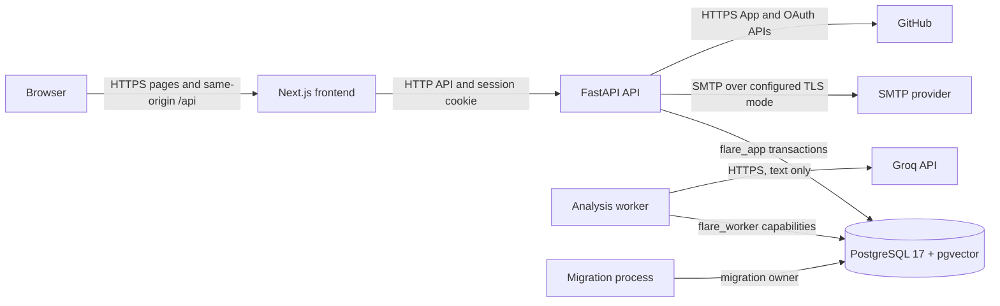
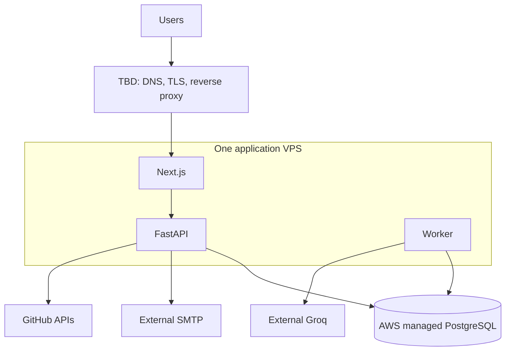

# Flare Architecture

This document describes the repository at migration head `0017`.

Status labels used throughout:

- **Implemented** — present in `main` and covered by repository tests.
- **Approved release direction** — agreed direction that still needs operational setup.
- **TBD / deferred** — not implemented, not selected, or explicitly postponed; do
  not infer a completed decision.

## 1. Product and system boundary

**Implemented.** Flare is a workspace-scoped knowledge application. A
user registers, verifies an email address when verification is enabled, captures
Notes, imports bounded CSV/TXT/Markdown text, searches the Vault, and reads
generated Flares with links to their supporting evidence. Capture/import/edit only
publish source versions; Analyze remains a separate bounded workspace action.

Settings provides an email support entry. The server reads the optional
`SUPPORT_EMAIL` value at request time and passes a validated public address to the
client. An absent or malformed value produces no `mailto:` link.

The repository owns the Next.js frontend, FastAPI API, PostgreSQL schema and
PostgreSQL-backed analysis worker. PostgreSQL is the durable source of truth.
Groq performs text analysis and Flare generation. SMTP delivers production
verification mail. GitHub supplies installation, account, and repository metadata
for the connection flow.

**TBD / deferred.** URL fetching, binary file ingestion, durable voice transcription,
GitHub activity ingestion, automated external-source synchronization, workspace
switching, invitations, and password reset are outside the current end-to-end
product boundary. The current Analyze selection is bounded and oriented toward
recent eligible sources; full durable project-memory semantics are not implemented
or guaranteed.

## 2. Repository map

**Implemented.**

| Path | Responsibility |
| --- | --- |
| `frontend/src/app/` | Next.js App Router pages, layouts, redirects, and auth bootstrap |
| `frontend/src/features/` | Capture, Vault, Analyze, Flares, Sources, auth, and settings screens |
| `frontend/src/components/` | Shared shell and UI components |
| `frontend/src/lib/data/` | Typed frontend provider boundary and API/mock adapters |
| `frontend/src/mocks/` | Explicit development demo data |
| `backend/app/api/` | FastAPI HTTP routes and request/response contracts |
| `backend/app/services/` | Auth, capture/import, analytics, operations, GitHub, analysis, and Flare use cases |
| `backend/app/models/` | PostgreSQL transactions, repositories, and job capabilities |
| `backend/app/ai_engine/` | Provider-independent AI contracts, validation, prompts, and Groq adapters |
| `backend/app/workers/` | Durable worker process and polling loop |
| `backend/migrations/` | Linear Alembic schema history |
| `backend/db/` | Self-managed and Yandex-compatible role provisioning |
| `.github/workflows/checks.yml` | Frontend and two-provider backend CI matrix |
| `compose.yaml` | Local PostgreSQL, migration, API, frontend, and opt-in AI worker topology |
| `docs/AWS_POSTGRESQL_READINESS.md` | AWS managed PostgreSQL compatibility audit and acceptance evidence |
| `backend/scripts/release_smoke.py` | Non-destructive deployed HTTP smoke for release candidates |

## 3. Runtime components

**Implemented.**

| Component | Runtime role | Credentials and state |
| --- | --- | --- |
| Next.js frontend | Pages, server auth bootstrap, same-origin `/api` proxy, browser UI | No database, Groq, SMTP, or GitHub secrets |
| FastAPI API | Sessions, verification, capture/import, analytics, queue operations, Analyze, Flares, and GitHub | `flare_app` database role; SMTP and GitHub App credentials |
| Analysis worker | Claims extraction and Flare-generation jobs and calls Groq | `flare_worker` database role and `GROQ_API_KEY` |
| Migration process | Applies Alembic migrations and owns privileged schema changes | Migration owner credentials only |
| PostgreSQL 17 + pgvector | Durable users, workspaces, sources, imports, events, jobs, Flares, and integration metadata | Separate runtime, worker, and migration roles |
| Groq | External text analysis and Flare generation | Called only by the worker |
| SMTP server | External verification-email delivery | Called only by the API |
| GitHub App APIs | External authorization, installation, and repository listing | Called only by the API |

## 4. Runtime architecture

**Implemented** behavior is shown with solid arrows. The database placement in
production follows the approved decision below.



## 5. Core Note → Analyze → Flare data flow

**Implemented.**

1. `POST /items` accepts Note, URL, or file-metadata records from a verified owner or
   editor. Direct audio placeholders are rejected. `POST /imports` accepts bounded
   UTF-8 CSV, TXT, or Markdown source text.
2. One transaction writes `documents`, a ready `document_versions` row, and its
   immutable `chunks`; `documents.current_version_id` points at the published
   version.
3. Item creation, text import and editing do not enqueue analysis. Imports use
   content-hash idempotency per workspace and split text into bounded chunks.
4. `POST /analyze` is the manual orchestration path. It accepts an empty JSON object
   plus an `Idempotency-Key` UUID and selects bounded, recent, ready chunks inside
   the caller's workspace. The database atomically reserves the workspace's daily
   slot and creates the cycle, `analysis_runs`, `analysis_jobs`, and pinned sources.
   A replay returns the original run; another logical request returns exact
   `409 daily_limit` when the local day or 20-hour guard is occupied.
5. A saved daily schedule uses the workspace's IANA timezone and local run time.
   At T-30, the worker reserves the same shared daily slot and pins exact immutable
   chunk IDs. At the selected time it creates one analysis run and job from that
   snapshot. Manual and scheduled paths therefore cannot both run for the same day.
6. The API returns pending or processing state without calling Groq.
7. The worker claims the analysis job with a lease, loads only the pinned evidence,
   releases the database connection, calls Groq, validates the structured result,
   and finishes the job through a restricted database function.
8. Completion enqueues one `flare_generation_runs` record. The same worker claims
   that stage, calls Groq outside a database transaction, validates source IDs and
   exact quotes, and atomically writes typed `insights` and `insight_sources`.
9. A successful scheduled generation with at least one Flare enqueues one durable
   notification. When enabled, the worker loads only the verified account email,
   Flare IDs, and titles, then sends one email through the existing SMTP transport.
10. The frontend polls `GET /analysis-runs/{id}` and reloads `GET /flares` when the
   run completes. Evidence links open the matching Note in Vault.

The request never calls Groq. Source writes remain committed independently from AI
configuration. A valid empty Flare result is a successful
completed run. URL and file-metadata records do not fetch or upload external content.

## 6. AI pipeline

**Implemented.** The worker uses the native Groq SDK through interfaces
in `backend/app/ai_engine/`. Text extraction and Flare generation use
`openai/gpt-oss-20b` with low reasoning effort. Configuration validation rejects
other text model profiles. Requests have byte, source, completion-token, transport,
and wall-clock bounds. SDK retries are disabled because the durable worker owns
retry scheduling.

Provider responses are parsed into strict application models. Evidence identifiers
and quotes must match the supplied immutable chunks. Persisted metadata uses an
allowlist; raw prompts, reasoning, private Note bodies, provider error bodies, and
credentials are not persisted as job errors.

**Approved release direction.** The 20B profile is the default text path. The project
model policy reserves 120B for explicit reasoning escalation.

**TBD / deferred.** No 120B routing or escalation is implemented. A quality set,
production Groq reachability, and live representative acceptance still need release
evidence. Analyze examines at most 200 recent eligible documents and then fits a
bounded set of chunks using recency and keyword signals.
It does not summarize or retrieve full project history. Redesigning that behavior is
deferred product and architecture work.

## 7. Durable jobs

**Implemented.** PostgreSQL is the queue. `analysis_jobs` and
`flare_generation_runs` store status, bounded attempts, availability, lease owner,
lease token, lease expiry, safe error code, and timestamps. Claims are atomic.
Expired leases make interrupted work recoverable. Transient failures use scheduled
exponential backoff with jitter and `Retry-After` support; permanent validation,
configuration, authorization, and source-invalidity failures terminate safely.

`analysis_runs` is the public orchestration record. Its workspace, requesting user,
idempotency key, source snapshot, and pipeline revisions prevent duplicate logical
runs. Worker access is limited to reviewed `SECURITY DEFINER` capabilities; the
worker cannot browse tenant tables directly.

`analysis_daily_quotas` keeps one retention-safe tombstone per consumed workspace
local date. Manual and scheduled creation serialize on a workspace lock and share
that row. The 20-hour separation guard prevents an immediate timezone-change bypass.
Scheduled cycles reserve the row at T-30, pin immutable chunk IDs, and enqueue from
that snapshot at the configured run time.

## 8. Authentication and email verification

**Implemented.** Registration creates an `auth_users` row, one
workspace, owner membership, and an opaque session. Passwords use Argon2id. The
database stores a SHA-256 digest of the random session token. Cookies are HttpOnly,
SameSite=Lax, host-only, and become `Secure` with the `__Host-` name in production.
Sessions have absolute and idle expiry and are revocable on logout.

Production enables email verification by default. Verification tokens are random,
stored only as digests, expire, and are single use. Resend has a cooldown and a
neutral response. An unverified session can access identity, logout, verification,
and resend endpoints; Notes, Vault data, Analyze, Flares, and GitHub integration
require a verified user. Migration `0008` marks pre-existing users verified.

**TBD / deferred.** The production SMTP provider, sender identity, deliverability
monitoring, bounce handling, password reset, rate limiting, and account recovery
process are not selected or implemented.

## 9. Workspace authorization and RLS

**Implemented.** The authenticated session determines the user and
initial workspace; the browser cannot submit trusted identity headers. Each
workspace transaction sets `app.workspace_id` and `app.user_id` locally, verifies
membership, and requires owner/editor for writes. Viewer access is read-only.

Tenant tables have enabled and forced PostgreSQL row-level security. Composite keys
and foreign keys prevent cross-workspace relationships. The API connects as the
restricted `flare_app` role without `SUPERUSER`, `BYPASSRLS`, role membership, or
schema ownership. Readiness fails if the schema revision is not `0017`, required
tenant tables lack forced RLS, or tenant rows are visible without context.

Auth tables are intentionally outside tenant RLS because session lookup happens
before workspace selection. They remain backend-only and are not exposed to clients
or the worker.

## 10. Database logical model

**Implemented.**

| Area | Tables | Relationship |
| --- | --- | --- |
| Identity | `auth_users`, `auth_sessions`, `auth_email_verifications` | User, revocable sessions, and verification tokens |
| Tenancy | `workspaces`, `workspace_members` | Workspace boundary and owner/editor/viewer role |
| Knowledge | `documents`, `document_versions`, `chunks` | Soft-deleted document, immutable published version, ordered evidence chunks |
| Analysis | `analysis_jobs`, `analysis_job_sources`, `analysis_runs`, `analysis_schedules`, `analysis_daily_quotas`, `analysis_cycles`, `analysis_cycle_sources` | Durable extraction job, retention-safe daily quota, schedule, immutable T-30 snapshot, and public idempotent run |
| Flares | `flare_generation_runs`, `insights`, `insight_sources` | Durable generation stage, typed Flare, and exact evidence quote |
| Notifications | `scheduled_analysis_notifications` | Durable titles-only email outbox for successful scheduled Flare runs |
| GitHub | `github_connection_states`, `github_connections` | One-time state and one selected repository per workspace |
| Imports | `import_batches` | Idempotent bounded text-import status and canonical document link |
| Analytics | `activity_events` | Bounded allowlisted product events without source bodies |

The initial schema retains nullable pgvector capacity, but the current Analyze flow
uses bounded recency and keyword signals rather than vector retrieval. Published
versions and chunks are immutable. Deleting a Note is soft deletion; Flares whose
evidence is deleted or no longer ready are hidden by the read query.

## 11. Frontend architecture

**Implemented.** Next.js App Router layouts bootstrap the authenticated
session on the server. Client feature modules use one `FlareDataProvider` contract.
`ApiDataProvider` owns HTTP calls, text imports, and strict DTO mapping; `MockDataProvider` owns the
explicit development demo. API mode never falls back to demo Flares or Notes.

The browser calls same-origin `/api`; Next.js rewrites it to `API_INTERNAL_URL`.
Auth uses cookies with `credentials: include`. State-changing calls are checked by
the API's exact-Origin guard. `WorkspaceProvider` coordinates capture, theme,
density, and data refresh. `/` and `/dashboard` redirect to `/insights`.

The Settings route is dynamically rendered and reads `SUPPORT_EMAIL` on the server.
Only a validated address reaches the browser. Unlike `NEXT_PUBLIC_*` settings, this
value can change when the deployment runtime restarts without rebuilding the
frontend image. The final address remains TBD.

## 12. Source integrations

### Implemented

- **Notes:** durable capture, Vault read/search, soft deletion, Analyze input, and
  Flare evidence.
- **Text imports:** bounded UTF-8 CSV, TXT, and Markdown ingestion with exact source
  text, locators, per-workspace hash idempotency, and durable source versions and
  chunks. Import does not enqueue analysis.
- **Operational visibility:** allowlisted workspace analytics with real-target checks,
  a 600-event actor/hour browser budget, and owner-only queue health/maintenance
  endpoints. Maintenance defaults to dry-run and includes bounded activity-event
  retention (90 days by default).
- **Portable export:** verified workspace owners can download active Notes, imported
  supported text, current visible Flares, evidence relationships, and safe source
  metadata as Markdown and JSON in a streamed ZIP. Authentication records, secrets,
  queue state, and other workspaces are excluded by construction and RLS.
- **GitHub connection:** GitHub App install/user authorization, workspace- and
  user-bound single-use state, installation ownership verification, repository
  listing, selection of one repository, durable connection metadata, and disconnect.
  Tokens are ephemeral and never stored. Release configuration requires the GitHub
  App to have read-only repository metadata permission and no other repository access.

The GitHub flow has automated provider, API, frontend-provider, migration, and RLS
coverage. PR #12 explicitly records that the real GitHub handshake and browser flow
have not been live verified.

### Active or draft

- **Voice:** browser recording, isolated Groq Whisper Turbo boundary, pipe-only
  ffprobe duration inspection, and immutable transcript persistence exist. The
  consent-gated upload/provider handoff and transcription-specific quota remain
  required before the release-ready end-to-end flow is enabled.

### Planned

- GitHub commits, pull requests, and issues ingestion; Vault normalization; Analyze
  inclusion; and evidence provenance.
- URL fetching, binary file ingestion, and durable audio ingestion.
- Telegram, Gmail, app reviews, Notion, Linear, and other catalog entries shown as
  coming soon or demo metadata.

## 13. Local development topology

**Implemented.** The default `compose.yaml` topology runs PostgreSQL, a
one-shot migration container, FastAPI on `127.0.0.1:8000`, and Next.js on
`127.0.0.1:3000`. PostgreSQL is exposed only on `127.0.0.1:5432`. The frontend waits
for backend readiness and backend waits for migration completion. The `ai` profile
adds one-shot worker-role configuration and the analysis worker; the worker waits
for role configuration and database health and restarts unless stopped.

Compose explicitly defaults to development, API data mode, and disabled email
verification. Development identity is available only through an explicit
`FLARE_DEV_MODE=true` configuration. A named `flare_data` volume persists local
PostgreSQL data.

## 14. Approved production topology

**Approved release direction.** Production uses one application server supplied by
Vova for the Next.js frontend, FastAPI API, and one worker initially. PostgreSQL is
a separate AWS-managed service. Groq remains external.



**TBD / deferred.** The exact AWS PostgreSQL service and network topology, VPS
provider, VPS country, exact VPS size, reverse proxy, domain structure, SMTP
provider, and deployment automation have not been selected. See the
[AWS readiness audit](AWS_POSTGRESQL_READINESS.md); it records compatibility and
required evidence without choosing RDS or Aurora.

## 15. Secrets and process boundaries

**Implemented.** API, worker, and migration dotenv roles are separate.
The API may receive `DATABASE_URL`, SMTP credentials, and GitHub App credentials.
The worker may receive `WORKER_DATABASE_URL`, `GROQ_API_KEY`, `APP_PUBLIC_URL`,
`SMTP_URL`, and `EMAIL_FROM` so it can deliver scheduled-result notifications.
The migration process alone may receive `MIGRATION_DATABASE_URL`. The dotenv
loader removes secrets that do not belong to the selected process role.

No backend secret belongs in a `NEXT_PUBLIC_*` variable or browser response. GitHub
private keys, OAuth client secrets, SMTP URLs, database passwords, session tokens,
verification tokens, and the Groq key must come from deployment secret injection.
Only example placeholders are tracked. `SUPPORT_EMAIL` is public contact data rather
than a secret, but the server validates it before exposing it in Settings.

## 16. Migration model

**Implemented.** Alembic has one linear head:

```text
0001 → 0002 → 0003 → 0004 → 0005 → 0006 → 0007 → 0008 → 0009 → 0010 → 0011 → 0012 → 0013 → 0014 → 0015 → 0016 → 0017
```

`0008` adds email verification and backfills existing users. `0009` adds GitHub
connection state and metadata. `0010` expands analysis source types, `0011` adds
bounded queue maintenance, `0012` adds activity events and source types, `0013`
adds import batches and import-safe chunk constraints, `0014` adds optimistic
source versions and exact import provenance, and `0015` adds daily schedules,
cycles, immutable source snapshots, and the database-enforced daily limit.
`0016` adds the scheduled-analysis email preference and durable notification outbox.
`0017` adds immutable, versioned Terms and Privacy acceptance records for new accounts.
Application readiness requires `0017`. CI tests both self-managed and Yandex-compatible upgrades,
historical upgrade steps, repeat `upgrade head`, role
ownership, RLS, preserved data, and worker isolation.

AWS production compatibility has not been proven by those matrices. The chosen AWS
service must pass a disposable migration, role, pgvector, TLS, RLS, readiness,
backup/restore, and connection-budget rehearsal before production.

Several migrations intentionally refuse automatic downgrade where data or security
review is required. Production migration credentials must never be reused by API or
worker processes.

## 17. Failure boundaries

**Implemented.**

| Failure | Boundary and behavior |
| --- | --- |
| PostgreSQL unavailable or wrong role/head | `/ready` fails; API/worker startup or operations fail closed |
| Groq unavailable or rate limited | Note data remains committed; job retries within bounded attempts or ends with a safe code |
| Invalid AI/worker configuration during item capture | Source data remains committed; capture never creates an analysis job |
| Invalid AI output or fabricated evidence | Entire stage fails; no partial Flare set is published |
| Worker exits mid-job | Lease expiry permits a later claim; idempotent database functions prevent duplicate terminal state |
| API restarts | Sessions, Notes, run state, and jobs remain in PostgreSQL |
| SMTP unavailable | Registration state remains durable; verification delivery must be retried operationally |
| GitHub provider failure | Connection routes return safe provider errors; no provider token is persisted |
| Note deleted during processing | Final capability checks reject or hide results tied to invalid evidence |
| Frontend cannot reach API | API adapter shows an explicit error and does not substitute demo product data |

**TBD / deferred.** Production monitoring, alerting, log aggregation, database
backup/restore drills, SMTP delivery operations, and deployment rollback automation
need owners and tooling.

## 18. Ownership and responsibility zones

**Implemented.**

| Zone | Owns | Must not own |
| --- | --- | --- |
| Browser/frontend | Presentation, interaction, DTO validation, polling | Trusted identity, database access, provider secrets |
| API | Auth, Origin checks, workspace selection, use-case orchestration | Groq calls during requests, migration credentials |
| Worker | Lease processing, Groq calls, validated stage completion, scheduled email delivery | General tenant browsing, API session or GitHub credentials |
| Database | Durable state, constraints, RLS, atomic capabilities | External API calls |
| Migration process | Schema and privileged role/function changes | Serving runtime traffic |
| External providers | Groq inference, email transport, GitHub authorization | Flare workspace authorization or final persisted truth |

## 19. Change-impact guide

**Implemented.**

| Change | Inspect and validate |
| --- | --- |
| HTTP payload or endpoint | `backend/app/api/`, `frontend/src/lib/data/`, `frontend/docs/API_CONTRACT.md`, API/provider tests |
| Auth, cookies, or verification | auth API/service/models, migration history, server bootstrap, auth and isolation tests |
| Workspace write/read behavior | service transaction boundary, RLS policies, composite keys, self-managed and Yandex tests |
| Analyze selection, daily quota, schedule, or status | analysis API/service/models, schedule worker, `0015`, frontend controller/provider, idempotency and job tests |
| Scheduled email | preference API, `0016` outbox capabilities, worker SMTP delivery, privacy and retry tests |
| Workspace export | owner authorization, RLS transaction, field allowlist, ZIP service, isolation and secret-exclusion tests |
| AI model, prompt, or bounds | central config, adapter, prompt/schema revision, worker retry metadata, current provider documentation |
| Worker lifecycle | claim/load/finish capabilities, lease semantics, restricted role, restart/failure tests |
| Flare schema or evidence | generation validator, `insights`/`insight_sources`, public DTO, evidence navigation tests |
| GitHub connection | API/service/provider, `0009`, RLS, frontend Sources state, live GitHub smoke |
| Text import/edit | import/item API and services, `0010`–`0014`, chunk bounds, version tokens, provenance, idempotency, frontend capture |
| Analytics or queue operations | allowlists, owner checks, RLS, safe metadata, dry-run and retention behavior |
| Database schema | new Alembic revision, `CURRENT_SCHEMA_REVISION`, migration scripts, both CI providers |
| Deployment config | role-specific env examples, Compose, health/readiness, release checklist |

## 20. Known unresolved and deferred decisions

**TBD / deferred.**

- VPS provider, country, and exact size.
- Reverse proxy and the root/www/app/api layout for the purchased `flare4u.tech` domain.
- SMTP provider and production sender/domain configuration; see the
  [provider decision](EMAIL_PROVIDER_DECISION.md) and [setup handoff](EMAIL_SETUP.md).
- External routing of the approved `support@flare4u.tech` address to a verified
  destination inbox.
- Exact deployment, secret injection, observability, and rollback automation.
- Exact AWS PostgreSQL service, engine/extension versions, network topology,
  authentication method, and production connection/pooling parameters.
- Production backup retention and restore-drill schedule.
- Any future plan-based allowance beyond the implemented one workspace analysis
  cycle per local calendar day. See the
  [decision record](ANALYZE_QUOTA_DECISION.md).
- Full durable project-memory behavior. Current Analyze context is a bounded,
  recent-Note selection and must not be represented as complete project history.
- Whether and how to implement evaluated 120B reasoning escalation.
- Voice upload/staging, server media inspection, cleanup, and transcript provenance.
- GitHub ingestion scope, synchronization schedule, normalization, and release timing.
- Workspace switching, invitations, password reset, and public rate limiting.
