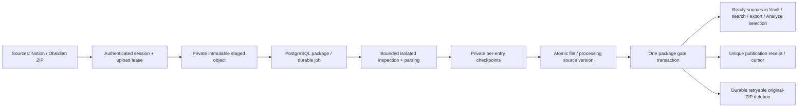

# DATA-002 — asynchronous ZIP snapshot onboarding

Application implementation for the accepted [DATA-002 contract](../../ONBOARDING_MEMORY_ATTRIBUTION_DECISIONS.md#data-002) and [DATA-001 research](../../research/DATA-001/). Prepared for owner review on 2026-10-02. Production rollout requires the separate OPS-001/Vova decisions.

## Coordination and migration

- Claimed task: DATA-002, Fedor / Codex / DATA-002.
- Fresh main inspected before claim: `080b83c56b1c0abb38318a0293251ee491558ac5`.
- Published claim / clean task branch base: `0491068867d38024421aa98b851886627d5d24b4`.
- Branch: `task/data-002-async-zip-20261002`.
- Integrated fresh coordination main: `9b9a44ae6885605a3f64c1ea80e35f1b2320c4c9`. No other active implementation scope overlapped at the final inspection.
- Sole new migration: `backend/migrations/versions/0019_zip_import_packages.py`, successor of actual head `0018`; resulting head `0019`.
- `backend/db/import_packages.sql` is the **0019 migration snapshot**. Keep it immutable after release, like the existing `schema.sql`; future changes require a successor migration. No old migration was edited.
- Existing migration checks now expect `0019`. The 0018 privilege regression still exercises 0018 independently against the new current database head.

The final published product HEAD and review transition are recorded through task-sync, separately from this report to avoid a self-referential commit hash. Nothing was force-pushed, deployed, or merged to main. Acceptance and marking done belong to the owner.

## Complete application path

Sources exposes Notion and Obsidian **one-time ZIP snapshots**. A capability read disables submission when no storage adapter is configured; demo providers cannot invent a successful import. The EN/ES flow creates a session, sends the original ZIP as a streamed octet body, finalizes it, polls real phases, shows checked/supported/imported/skipped/failed file counts, allows cancellation and eligible retry, and pages the terminal entry report. It resumes recent server state after navigation/reload. Counts replace speculative percentages; staged sources are never presented as imported. Unknown creation outcomes retain the same request key; action epochs fence late responses and a synchronous guard prevents double submission.

No import path starts Analyze, consumes its daily allowance, creates an analysis job/run, calls an AI provider, or performs enrichment. No OAuth, watcher/plugin sync, or snapshot reconciliation is implemented. A different ZIP is another onboarding import.

## Durable state, gate and provenance

`import_packages` contains session state plus the durable job's attempts, available time, deadline, lease token/generation, expiry, policy snapshot, progress and source reservation. `import_package_entries` holds bounded immutable-manifest positions, private parsed checkpoints, file hashes, and composite workspace/document/version links. `import_objects` records **each upload attempt before I/O**, including incomplete objects and their cleanup leases. `import_publications` is the durable downstream observation contract.

Ordinary application code has tenant-filtered reads and narrow authenticated mutation capabilities. `flare_worker` can execute only the import claim/step/cleanup capabilities; it cannot select package tables or perform arbitrary source DML. New tables have forced RLS and are included in readiness inventory. Private parsed checkpoints/object keys are excluded from ordinary entry/object reads. Definer functions use a fixed search path; PUBLIC execution is revoked. The self-managed executor's temporary migration CREATE privilege is revoked before migration completion; the Yandex-compatible path uses the existing non-bypass owner role.

Each prepared supported file publishes its document/version/chunks atomically into a **private** processing version with a null current pointer. Preparing a file is restartable and cannot duplicate it. The final transaction checks authorization, lease/generation, deadlines, quotas, counts and entry states, marks all staged versions ready, sets current pointers, commits the package outcome and inserts exactly one publication receipt. Cancellation and the gate serialize under the same locks. A failed transaction opens no part of the gate.

Restrictive RLS on documents, versions and chunks hides pre-gate content from every `flare_app` reader, including direct historical queries. Existing manual and scheduled worker selection additionally joins current ready versions; processing versions have no current pointers. Tests exercise item list/detail, search, export, direct source/chunk reads, the real manual selection path and the real scheduled candidate function before/after the gate. Existing citation/evidence readers are covered by those database policies; existing evidence/version regressions remain in the full suite.

Original relative paths, source kind, package ID, file hash, source version and chunk locators survive publication. Vault displays the relative path, and portable exports preserve the package provenance metadata. Duplicate titles in separate safe paths remain separate sources. Published ready snapshots retain the existing immutability/citation behavior.

Exact ZIP deduplication is keyed by workspace, source kind and SHA-256 of the **original archive bytes**. Concurrent finalize calls return one canonical package. Completed receipts stay canonical after original sources are edited or soft-deleted; replay does not recreate documents or emit another publication event. Original path metadata is report/provenance data, never a filesystem extraction path.

### Downstream publication observation

`GET /imports/packages/publications?after=<integer cursor>&limit=<bounded page>` returns workspace-filtered committed outcomes in ascending receipt-ID order. Each contains package ID (stable logical outcome), workspace context from the authenticated request, requester user ID, source kind, publication timestamp, source count and chunk count. Follow `nextCursor`; replaying a read is safe. Entry reports supply the original version/document IDs. There is no delivery acknowledgement or exactly-once external consumer claim: GROWTH owns its own cursor/deduplication and later attribution policy. Nothing triggers enrichment before the gate.

## Security and configurable bounds

[policy.md](policy.md) enumerates every independent control. All shipped defaults are explicitly **development/test fixtures, not production-optimal settings**. Packages pin the policy under which they were admitted; new sessions see changed configuration. Production storage requires an explicitly configured server-owned policy: the standard environment loader requires every value, or the application factory can receive an explicit policy object. The local adapter is rejected in production.

The ZIP decoder checks actual central-directory headers/counts before allocating ZipFile entry objects. Paths use a portable, case-insensitive NFC collision policy: absolute/drive/UNC/backslash paths, dot/empty segments, controls/format controls, Windows reserved names and trailing dot/space segments are refused. Prefix file/directory conflicts, symlinks and special objects are refused. Encrypted entries, multi-volume archives, ZIP64, unsupported compression and inconsistent/truncated structures are refused by this bounded v1 adapter. Stored and Deflate entries are supported. ZIP64 rejection is a format capability boundary, not a proposed production byte limit.

The decoder checks local headers, overlaps, actual full decompressed size, EOF, CRC and streaming data descriptors rather than trusting declared uncompressed sizes. Limits apply to **skipped entries too**: configuration, images, PDF, audio/video, Office, nested archives, HTML/JSON/Canvas and unsupported plugin/application data are verified, skipped and reported. Nested ZIPs are never opened recursively. Supported text uses strict UTF-8; Markdown/frontmatter and CSV quoting/multiline content remain inert source text. Nothing is extracted, interpreted, executed or sent to AI.

One file buffer, central directory/manifest and child output are bounded independently. UTF-8 BOM is accepted and removed consistently with the existing single-file importer; all other text is preserved. Short whitespace-only Markdown sections fold into neighbouring chunks without changing characters. A whitespace gap that cannot fit the existing nonblank-chunk schema under configured chunk bounds fails the package rather than silently discarding content.

Parsing runs in a separate child process with wall-clock supervision, CPU/file-output bounds, private server-generated scratch descriptors and no database/provider credentials in its environment. Linux applies RLIMIT_AS; macOS does not accept it and uses parent RSS supervision instead. These are application bounds, not a replacement for the production container/cgroup/OS limits and adapter I/O timeouts that OPS must verify.

Workspace admission and source reservations serialize against concurrent ZIP imports. Staging accounting includes every undeleted attempt plus unstarted reservations. Source accounting includes existing workspace chunks, provisional source bytes and unmaterialized parsed reservations; the gate rechecks actual source usage. Completed/cancelled/expired obligations release reservations appropriately. Existing single-file capture remains compatible; this task does not impose a new universal workspace quota on every unrelated note/edit operation.

## Recovery, cancellation and deletion

- Claims use short PostgreSQL transactions, SKIP LOCKED and a serialized global admission check. Both the worker-requested and stored server-policy concurrency bounds apply.
- Every mutable worker step checks lease token, generation, expiry, authorization and job/staging deadline. Heartbeats surround bounded subprocess work. The archive digest is checked on every restart.
- Checkpoints distinguish inspected entries, parsed entries and staged files. Restart skips completed file work. A lost lease cannot checkpoint or open the gate. Expired attempts are bounded; transient storage/worker errors back off and can be accelerated by an eligible explicit retry.
- Cancellation invalidates the generation/token. Neither cancelled nor failed packages expose their private source versions. Cleanup removes private provisional sources/checkpoints without altering published immutable versions, including after requester permissions are revoked.
- Successful publication immediately makes the original sealed object eligible for cleanup. Failed/cancelled/abandoned writing attempts remain quarantined until their upload deadline, preventing deletion under an active write.
- Cleanup has its own claim token/expiry, retry/backoff and durable overdue flag. A storage deletion error does not revoke published sources or forget the obligation. Successful deletion is idempotent. The expiry is an overdue/alert boundary, not permission to drop an undeleted obligation.

The explicit local/test adapter uses a private root, no-follow directory-relative operations, regular files, exclusive immutable keys, private permissions, fsync, nonblocking per-key locks and zero-content retirement markers. `.zip` and `.part` payload files are deleted. Tiny `.lock`/`.retired` metadata remains for each immutable key so a process paused **before object creation** cannot resurrect an already-cleaned object. Removing those markers while stale writers might exist is unsafe. Production adapters must provide equivalent immutable-key retirement and bounded I/O; local filesystem inode/metadata retention is not a selected production topology. Physical deletion is an irrevocable terminal-object operation; stale completion writes remain lease-fenced and a late deletion cannot affect a new upload key.

## Local/test run

Use an explicitly disposable migrated PostgreSQL17/pgvector environment, its existing restricted API/worker roles, and a private local staging directory. Do not copy test provisioning scripts or test credentials to production.

1. Set `FLARE_ENV=development` or `test`, `DATABASE_URL` for `flare_app`, exact `CORS_ORIGINS`, and the existing authenticated or explicit development identity configuration.
2. Set `FLARE_IMPORT_STAGING_ROOT` to a mode-0700 directory reachable by the local API and dedicated import worker.
3. Run the normal API and frontend. No import work runs in the request process after finalize.
4. From `backend/`, run `python -m app.workers.import_worker`; its separate `WORKER_DATABASE_URL` must use `flare_worker`. `--once` processes at most one package plus one cleanup obligation.
5. Override independent bounds with the documented `FLARE_IMPORT_*` variables. There are no production credentials or infrastructure defaults in this report.

[validation.md](validation.md) records checks and measured evidence. [evidence/](evidence/) contains synthetic machine-readable results.

## Production boundary / remaining OPS-001 and Vova work

Application work is complete for review; production deployment remains separate. OPS/Vova must accept the production storage service/adapter and upload path, API/worker access topology, authentication/network policy, process CPU/RAM/scratch isolation, storage I/O timeouts and retirement/deletion guarantees, cleanup monitoring/alerts and receipt/metadata retention. They must supply **individually measured and approved** production policy values from the chosen topology and real workload, including database gate latency, concurrent tenants and quota-accounting costs. No Azure resources, shared filesystem, credentials, CORS/identity/network changes, production limits or deployment were selected here.

## Primary documentation checked

Context7 resolved/fetched the current Python, FastAPI, PostgreSQL and React documentation during implementation. Version-specific/primary pages were checked on 2026-10-02:

- [Python 3.12 ZIP API](https://docs.python.org/3.12/library/zipfile.html): file-like readers, entry metadata and supported compression; it does not replace application resource/path policy. The implementation adds actual-size/CRC/descriptor verification and refuses extraction.
- [Python 3.12 resource API](https://docs.python.org/3.12/library/resource.html): available limits depend on the host. The macOS AS-limit failure and RSS alternative were measured locally.
- [PostgreSQL 17 RLS](https://www.postgresql.org/docs/17/ddl-rowsecurity.html): FORCE RLS and restrictive-policy composition informed the source gate and tenant tests.
- [PostgreSQL 17 SELECT locking](https://www.postgresql.org/docs/17/sql-select.html): SKIP LOCKED is used for queue/cleanup claims with separate application-level leases/fencing.
- [FastAPI request access](https://fastapi.tiangolo.com/advanced/using-request-directly/): direct request handling is paired with explicit upload validation; the ZIP body is streamed, not implicitly trusted by schema validation.
- [React effect cleanup](https://react.dev/reference/react/useEffect): polling cleanup plus epochs/abort guards prevents late requests from replacing current import state.

These sources establish API/mechanism behavior. They do not establish Flare's production capacity or limits.
