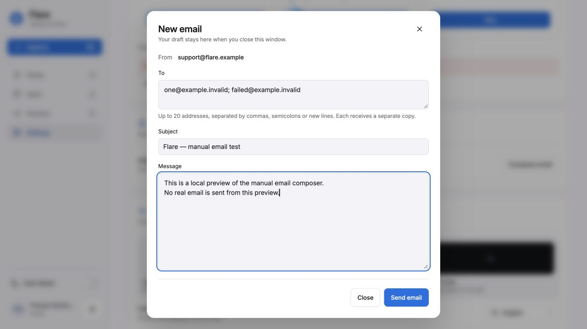
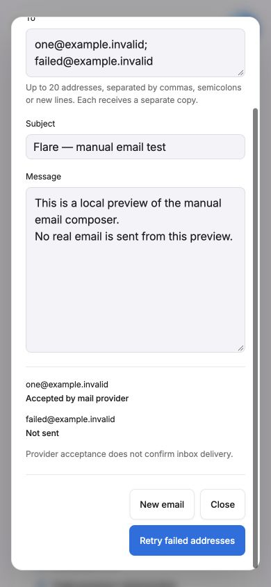

# WEB-007 validation — 2026-10-10

- Backend: 37 focused tests passed (`test_developer_mail.py` and existing
  `test_smtp_email.py`). Includes anonymous and nondeveloper denial, pinned-ID/email
  checks, unverified/legal gates, no inherited customer-owner privilege, fail-closed
  policy, header/recipient validation, explicit rejection versus uncertain outcomes,
  separate copies, bounded concurrency, and the real application's origin guard /
  router wiring. No live database or SMTP was used. Existing Starlette/httpx
  deprecation warning does not affect the result; no dependency upgrade was made.
- Frontend: all 264 tests passed after restoring the existing lock-file dependencies
  with owner approval. Nine new behavioral tests cover paste, permissions, drafts,
  duplicate submission, validation, partial retries, lost-response handling, localized
  copy, and authenticated HTTP payloads. The final focus-only change was followed by
  another successful run of the nine mail tests.
- ESLint, TypeScript `--noEmit`, and the final Next.js production build passed.
  Dependency manifest and lock file are unchanged. Initial build attempts lacked
  already-declared dependencies in reused local directories; the approved restore
  resolved this. No new package or version was introduced.
- Browser: final production build on loopback with a synthetic account / API fixture.
  English and Spanish composer rendered. Opening focuses To. Escape closes the
  dialog, restores focus to Compose email, and reopening retains recipients, subject
  and body. Pending controls disable; synthetic partial results show Accepted / Not
  sent and retry only for failed addresses. At 390×844, fields and outcomes fit without
  horizontal overflow; dialog scrolling reaches every footer action. Viewport override
  was reset after the test. All addresses and mail results in the preview are synthetic.
- Whitespace / declared-file-scope review performed before publication. Main/config /
  database and active OPS-005 / API-005 scopes are untouched.

## Remaining live checks

No production deployment, private developer grants or SMTP configuration was changed.
Live delivery, reply routing and SPF/DKIM/DMARC headers still require a configured
provider and the release owner's rollout. The earlier neutral resend-verification
response did not establish sending. Arc Gmail contents remained unavailable, so
receipt of that message is unconfirmed. The connected Gmail account did not match
the intended recipient and its messages were not inspected.

The code is ready for review, not accepted or activated on the live website.
