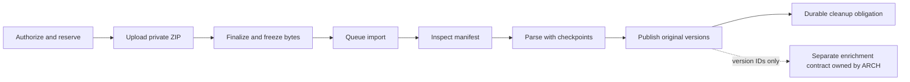

# DATA-001 — Asynchronous ZIP onboarding ingestion

Research date: 2026-10-02. Status: research/design proposal awaiting review and product acceptance. This report does not approve infrastructure, production settings, or implementation.

## 1. Assignment, source snapshot, and result

- Task: `DATA-001`, claimed by `Fedor / Codex / DATA-001`.
- Initial fresh main/context SHA: `80dc00d7b471621908c5f4d1e215da5032429073`.
- Published claim SHA and clean task-branch base: `e90279640a4c410b172dbc92739c109fd5d6b40d`.
- Repository facts below are pinned to that branch base. The last product/setup commit at that point is `348ee62e18056b1330c2e9c8102181da231ffeaf`; intervening main commits were coordination changes.
- Branch: `research/data-001-async-zip-20261002` ([remote branch](https://github.com/VladimirMalevanik/flare/tree/research/data-001-async-zip-20261002)).
- Declared write scope: `docs/research/DATA-001/`, published by task-sync at `2c5e6bea741c369d63b56cfb51a2d8d19b89d917` before editing.
- Required result: this report, the reproducible [measurement harness](measure_zip.py), and its [raw results](measurements.json). Product code, migrations, runtime configuration, and deployment remain read-only.

The existing synchronous text importer is a useful source-version model, but it is not a ZIP upload or asynchronous package processor. The proposed contract separates authenticated upload, private durable staging, bounded inspection/parsing, publication, and cleanup. Ingestion performs no AI calls and never starts normal Analyze. A dedicated import worker should reuse PostgreSQL lease/checkpoint principles while remaining independent of analysis scheduling and provider budgets.

Product direction already supplied by the task: Notion ZIP rather than OAuth; Obsidian ZIP rather than local/plugin sync; primarily one-time project onboarding; asynchronous processing; configurable limits; no image analysis in version one; no long-term original-ZIP retention after successful processing. Reconciliation with subsequent exports is outside this task.

The decisions still needed are publication semantics, attachment support, duplicate/reimport behavior, quota and expiry policy, and Vova's staging/runtime/network choices. Every numeric value in the benchmark is a fixture or measurement, not a proposed production limit.

## 2. Repository evidence and gaps

Links in this table use the exact source SHA rather than moving main.

| Evidence at source SHA | Observed behavior | Consequence for ZIP design |
| --- | --- | --- |
| [Import service](https://github.com/VladimirMalevanik/flare/blob/e90279640a4c410b172dbc92739c109fd5d6b40d/backend/app/services/import_service.py#L15) | JSON UTF-8 text; 200,000-byte limit, 20,000 CSV rows, 2,000 chunks, 4,000-byte target. Creates one file document, immutable version, chunks and completed batch in one transaction. | These are existing small-file safeguards, not ZIP settings. Parsing materializes the text/chunk collection. Do not loop the HTTP importer over an unbounded archive or lift its constants globally. |
| [Import API](https://github.com/VladimirMalevanik/flare/blob/e90279640a4c410b172dbc92739c109fd5d6b40d/backend/app/api/imports.py) | Authenticated text POST; verified user; workspace write checks; immediate result. GET returns completed batches. Import telemetry is best effort. | Add a separate package resource/status contract; preserve this API for existing text imports. Need durable pending/failure/progress independently of activity events. |
| [Import model](https://github.com/VladimirMalevanik/flare/blob/e90279640a4c410b172dbc92739c109fd5d6b40d/backend/app/models/import_batches.py) and [0013](https://github.com/VladimirMalevanik/flare/blob/e90279640a4c410b172dbc92739c109fd5d6b40d/backend/migrations/versions/0013_import_batches.py) | `csv/txt/md`, narrow file-size/state constraints; one document per batch. Workspace-scoped hash deduplication; later versioning preserves historical batch links and supersedes replaced/deleted imports. | An archive is not one existing batch row. Prefer new package/entry records linked to immutable document versions. Preserve current import guarantees. |
| [Storage boundary](https://github.com/VladimirMalevanik/flare/blob/e90279640a4c410b172dbc92739c109fd5d6b40d/backend/app/services/storage.py) | Protocol only, with whole-byte `put/get/delete`; no implemented Blob staging adapter found. | Durable staging is a new dependency/operating decision. Design streaming/range/spool operations; this protocol's whole-byte `get` cannot establish bounded ZIP memory. |
| [Worker jobs](https://github.com/VladimirMalevanik/flare/blob/e90279640a4c410b172dbc92739c109fd5d6b40d/backend/app/models/analysis_jobs.py), [worker entrypoint](https://github.com/VladimirMalevanik/flare/blob/e90279640a4c410b172dbc92739c109fd5d6b40d/backend/app/workers/analysis_worker.py) | Durable PostgreSQL claims, restricted `flare_worker`, lease tokens, attempts, bounded DB calls; provider work outside transactions. `celery_app.py` and `tasks.py` are placeholders. | Reuse the pattern, not analysis jobs or daily slots. No existing Redis/Celery import queue is established by those filenames. New import capabilities/permissions are needed. |
| [Tables/repository](https://github.com/VladimirMalevanik/flare/blob/e90279640a4c410b172dbc92739c109fd5d6b40d/backend/app/models/tables.py), [0014 versioning](https://github.com/VladimirMalevanik/flare/blob/e90279640a4c410b172dbc92739c109fd5d6b40d/backend/migrations/versions/0014_versioned_source_editing.py) | Ready versions and current-version pointers define visible content; historical version reads preserve provenance; source deletion is soft deletion. | Package visibility must cover every item/search/export/Analyze/citation reader. Incomplete import data must not accidentally become eligible evidence. |
| [Vault](https://github.com/VladimirMalevanik/flare/blob/e90279640a4c410b172dbc92739c109fd5d6b40d/frontend/src/features/vault/vault-page.tsx#L18) and table queries | Files filter; 50-item pages with cursor loading; item reads concatenate full chunk content; text search uses chunk/title matching. | Import progress cannot be inferred from Vault counts. Large-file responses need separate detail bounds; path/group provenance and publication-aware paging require design. |
| [Database readiness](https://github.com/VladimirMalevanik/flare/blob/e90279640a4c410b172dbc92739c109fd5d6b40d/backend/app/models/database.py#L17) and [0018](https://github.com/VladimirMalevanik/flare/blob/e90279640a4c410b172dbc92739c109fd5d6b40d/backend/migrations/versions/0018_rotate_analysis_context.py) | Linear migration head `0018`, parent `0017`; readiness checks exact head and tenant tables with forced RLS. | Future migration ordering must be coordinated. Add new tenant tables, permissions and readiness checks as one implementation slice; no migration number is reserved here. |
| [Architecture §14–15](https://github.com/VladimirMalevanik/flare/blob/e90279640a4c410b172dbc92739c109fd5d6b40d/docs/ARCHITECTURE.md), [release workflow](https://github.com/VladimirMalevanik/flare/blob/e90279640a4c410b172dbc92739c109fd5d6b40d/.github/workflows/azure-appservice-release.yml), [worker bootstrap](https://github.com/VladimirMalevanik/flare/blob/e90279640a4c410b172dbc92739c109fd5d6b40d/backend/deploy/bootstrap_flare_worker.sh) | Docs state approved single application server with separate AWS DB; Azure artifact/startup files also exist. Bootstrap recreates `/tmp/flare_worker_runtime` and starts analysis worker. | Repository packaging does not prove actual deployed topology, plan capacity, cross-app mounts, managed identity, or a storage account. Never stage imports in that reset runtime directory. Vova must confirm deployment facts. |

No secrets, `.env`, credential stores, or live customer data were accessed. No live Azure configuration or production throughput was verified. Notion/Obsidian topology findings are documentation-based; the benchmark uses synthetic text, not real exported workspaces.

## 3. Package contents and source fidelity

### Notion

Notion documents Markdown & CSV export as a ZIP containing page Markdown and database CSV, with subpages included when selected. Callouts can contain HTML within the export. Nested subpage folders are possible; exports exclude pages the exporting user cannot access. These facts establish supported topology, not a lossless Notion schema. [Notion export documentation](https://www.notion.com/help/export-your-content).

Proposed input guidance: export the relevant project pages with Markdown & CSV and subpages, then upload the resulting ZIP. HTML/PDF export variants should get explicit unsupported-format guidance unless approved separately. Preserve database CSV and page Markdown as separate source files; do not silently deduplicate database rows against page text or reconstruct relations, formulas, permissions, or Notion block identity. A page-like ID suffix in a filename can be retained as an unverified source hint; do not claim authoritative API IDs from a heuristic.

Keep a bounded manifest of exact original relative paths. Display titles may remove noisy suffixes, but source identity/path may not. Preserve the selected archive-root mapping and internal relative references. Missing pages, attachments, and unavailable links are reported as unresolved, never invented or fetched over the network. An export cannot prove that omitted history or completion evidence does not exist.

### Obsidian

Obsidian stores Markdown notes in a local vault folder and its subfolders. `.obsidian` contains settings/plugins, not just notes. [Obsidian storage documentation](https://help.obsidian.md/Files+and+folders/How+Obsidian+stores+data). Internal links can be wikilinks or Markdown links, with headings/block references and embeds. [Obsidian internal-link documentation](https://github.com/obsidianmd/obsidian-help/blob/master/en/Linking%20notes%20and%20files/Internal%20links.md). Properties are YAML-frontmatter content. [Obsidian properties documentation](https://github.com/obsidianmd/obsidian-help/blob/master/en/Editing%20and%20formatting/Properties.md).

Proposed input guidance: ZIP one intended vault/project folder. Keep subfolders and original note names. Do not execute plugins, templates, Dataview, scripts, or embedded HTML. Preserve YAML/frontmatter and wikilinks in source text; optional parsed tags/aliases are derived metadata and cannot replace the original. Resolve links against the manifest only: retain root-relative and source-directory-relative forms as appropriate; percent decoding belongs to link resolution, not filesystem extraction. Ambiguous basename-only links remain ambiguous. A wrapper folder may be mapped to a logical root only by recorded, deterministic policy; do not flatten two apparent vault roots into one without user selection.

### Candidate format policy for product approval

| Content | Proposed version-one treatment | Fidelity/reporting |
| --- | --- | --- |
| `.md`, `.markdown`, `.txt`, `.csv` | UTF-8, optional leading BOM; bounded deterministic parser; reject malformed/binary text per file policy. | One source document per supported file. Keep raw-byte hash, normalized-content hash, parser revision and reversible locator mapping. CSV must retain headers, quoted multiline fields and row/line spans. |
| YAML/frontmatter, code fences, inline HTML inside Markdown | Preserve as literal source; rendering must escape/sanitize. | No script execution, HTML fetch, YAML object construction or automatic template evaluation. If metadata extraction is added, bound nesting/aliases independently. |
| Images | Skip/report; never analyze or upload to AI. | Record safe relative path, extension and declared size, plus reason. Links can show unavailable asset status. Original image bytes need not be retained under this proposal. |
| PDF, audio, video, office files and other non-image attachments | **Open product decision**, not silently supported. Recommended initial handling is skip/report until deterministic extraction, consent, resource and retention policies are separately approved. | PDF OCR/audio transcription can create provider work; ingestion must not infer authorization. Decide whether retaining originals is needed, which changes ZIP-delete/storage semantics. |
| Standalone `.html`, `.json`, `.canvas`, plugin databases | Explicit unsupported entry or future adapter. | No promise to reproduce Notion HTML exports or Obsidian Canvas graphs. |
| `.obsidian/`, `.git/`, operating-system metadata such as `__MACOSX`, `.DS_Store`, configuration/credential-like files | Skip by explicit package policy and report grouped counts. | Ignore application/plugin machinery. Validate metadata safety for all entries before filtering. Do not blanket-drop every dotfile: legitimate notes need an explicit rule. |
| Nested ZIP/archive attachments | No recursive extraction in the proposed initial contract. | Report unsupported nested archive. Archive nesting policy is independent of path-depth limits. If future support is selected, use cumulative limits across the entire recursion tree. |

An unsupported file is a declared skip, not a silently lost success. Completion must report eligible, imported, skipped, failed and unresolved-link counts. A ZIP with no eligible nonempty source files gets `no_supported_content`; it is not a successful populated Vault.

### Provenance contract

Persist workspace/package/entry identity; original decoded relative path; canonical collision key; archive-root mapping; source kind (`notion_zip`/`obsidian_zip`); source-supplied timestamp labelled untrusted; archive hash; entry raw-byte and content hashes; byte sizes; encoding; parser/normalization revisions; immutable document/version/chunk IDs; ordinal, heading/line/CSV locators. ZIP timestamps are not a verified source creation date or timezone.

Preserve text and chunk order. If BOM/line-ending normalization occurs, record it and preserve enough mapping to explain byte versus text offsets. Sanitized display paths do not overwrite provenance. Duplicate titles are allowed; duplicate canonical paths are rejected. Two paths with equal content can be two distinct documents: path participates in entry identity. Do not merge knowledge documents solely because their bytes match.

## 4. Upload and staging lifecycle

All identifiers below are proposed contracts, not existing endpoints.

1. Create a workspace-scoped import session after verified membership and owner/editor authorization, Origin/CSRF checks, admission limits, and an atomic concurrent-import/storage reservation. Accept source kind, filename for display, declared size and `Idempotency-Key`. Server generates package/object identity; it never accepts arbitrary object URLs or customer-chosen filesystem targets.
2. Upload bytes into a private namespace isolated by workspace/session IDs. Count actual received bytes and hash during server-mediated upload. Enforce time/rate and byte bounds even when Content-Length is missing or dishonest. Disconnect leaves a bounded, expiring staging session, not an eligible document.
3. Finalize only a completed object. Verify actual size/object ownership and identify exact immutable bytes; compute/verify the archive SHA-256 server-side. Pin storage version or ETag-backed frozen identity before queueing. Commit the ready import and queue/outbox intent together. Never enqueue based solely on a browser callback or filename.
4. Worker claims the persisted session and verifies the pinned object. Obtain a bounded seekable spool or bounded range-reader; standard ZIP reading requires seekability. Spool allocation and downloads consume worker scratch/staging quota. Inspect directory, then parse supported entries in bounded reads. No request thread performs full extraction or parsing.
5. Persist entry outcomes and immutable source versions according to the publication choice below. Record terminal outcome and durable cleanup obligation transactionally. Completion of import is independent of downstream enrichment availability.
6. Delete the original staged ZIP and scratch data after durable publication/terminal policy; a sweeper retries cleanup independently. Keep provenance, hashes, counters and a minimal result manifest, not original ZIP bytes. If deletion is delayed, show cleanup pending operationally; do not reverse a successfully committed import.

### Upload/staging alternatives

| Alternative | Advantages | Limits/conditions |
| --- | --- | --- |
| API streaming upload into private durable storage | Server can enforce byte cap while receiving; same-origin flow, simpler authorization. | Adds API bandwidth and duplicate transit; front proxy/timeouts/body buffering must be verified. Upload can be long, while processing remains async. Must not materialize a whole multipart body/ZIP in RAM. |
| Browser direct block-blob upload with narrowly scoped temporary authorization | Removes large upload traffic from API; block staging/final commit can support resumable transport. | Requires Vova-approved Blob account, CORS, identities/network. A SAS is not an application-level maximum-byte quota; oversized uploads can incur storage costs before finalize rejects them. Need reservations, monitoring, cleanup and abuse controls, or choose proxy for strict transport cap. |
| Shared durable filesystem | Potentially reuses an approved application server. | Must prove API/worker reach the same durable volume after restart/redeploy/scale-out; needs quota, locking and cleanup. Local process `/tmp` alone cannot satisfy recovery. |
| PostgreSQL ZIP byte storage | Could make upload/job references transactional. | Increases WAL, replication/backup footprint and DB contention; not recommended for large one-time archives. Small bounded staging would still need load evidence and owner approval. |

Azure documents user-delegation SAS through an authorized Microsoft Entra identity and scoped permissions. Prefer HTTPS-only, a single random upload object, short configurable lifetime and no list/read/delete permissions for the browser where the chosen operation permits it. Credentials/tokens must not be logged. [User-delegation SAS documentation](https://learn.microsoft.com/en-us/azure/storage/blobs/storage-blob-user-delegation-sas-create-python).

Azure block upload consists of staged blocks and a committed block list; concurrent writers to one blob require coordination. [Blob upload documentation](https://learn.microsoft.com/en-us/azure/storage/blobs/storage-blob-upload). Application idempotency must sit above transport block retries.

**Finalize race:** a still-valid browser upload token must not allow modification of worker input. Use a server-only frozen destination or a verified pinned version. If copying, condition the copy on the observed source ETag, wait for successful copy, verify final size/hash and only then queue it; do not mistake copy initiation for completion. Version pinning requires deletion of retained versions later. ETag conditional access prevents using changed content; it is not a content digest. [Blob concurrency documentation](https://learn.microsoft.com/en-us/azure/storage/blobs/concurrency-manage). The exact storage API/permissions need implementation-time verification for the selected SDK/service version.

## 5. ZIP inspection, extraction safety, and configurable bounds

Python's ZIP reader supports seekable inputs, ZIP64 and per-member streams; it exposes central-directory entry metadata. The runtime-targeted 3.12 documentation warns about decompression/resource failures and path safety. Do not assume an extension check, magic check, or `extractall` supplies the policy below. [Python 3.12 zipfile documentation](https://docs.python.org/3.12/library/zipfile.html). Context7 was consulted first; its CPython main snippets were cross-checked against this runtime documentation because main is not the repository's packaged Python 3.12.

The following is the proposed Flare policy, not a claim that the standard library enforces it. OWASP recommends layered upload validation, authorized access, private storage and decompression-aware bounds. [OWASP file-upload guidance](https://cheatsheetseries.owasp.org/cheatsheets/File_Upload_Cheat_Sheet.html).

### Validate before allocating/reading unbounded work

- Use a bounded upload/spool and isolate parsing in a resource-limited worker process. A central-directory parser can allocate every entry before `infolist()` length is checked. Pre-bound directory bytes/advertised entry count where supported by a reviewed parser, and always enforce process memory/CPU/time limits. Merely iterating `infolist()` is not a preallocation memory defense.
- Check ordinary/ZIP64 directory structures, offsets, consistency, truncation, counts and compression method allowlist. Do not implement a permissive handwritten ZIP scanner as a shortcut. Reject malformed/overlapping archives and local-header versus directory inconsistencies through the chosen reviewed parser plus explicit policy checks.
- Reject encrypted/strong-encryption entries anywhere in the archive, even an ignored attachment; no password collection/decryption. Reject symlinks, device/FIFO/socket and unsupported special entries; do not restore ownership/modes. Multi-volume/split archives and unsupported compression get actionable errors.
- Validate exact original member names before normalization/truncation: reject absolute paths, drive/UNC forms, backslashes under the proposed strict portability policy, NUL/control characters, empty/`.`/`..` segments and overlong/deep paths. Preserve safe Unicode names; compare normalized collision keys. Reject duplicate entries and normalization/case collisions, file-versus-directory prefix conflicts, and ambiguous roots. Do not rename unsafe paths into apparently safe ones.
- Prefer reading entries directly into bounded parser buffers, avoiding filesystem extraction. If scratch extraction is required, use server-generated filenames plus the path manifest, exclusive creation, no-follow handling and a private scratch root; never concatenate a member path to a filesystem root. No shell invocation using archive names. Never execute scripts or follow external links.
- Check declared compressed/expanded sizes before decompression, then increment actual expanded-byte and per-file counters during streaming and abort at configured bounds. Limit CPU/wall time as well as bytes. Compression ratio is an independent heuristic/guard; high-ratio legitimate text may require policy review. Actual counters and process limits remain necessary when metadata lies.
- Read supported entries to EOF to validate CRC/integrity before publication. CRC detects corruption, not authenticity; hashes identify the bytes. Skipped assets need not be decompressed for CRC validation; their metadata remains labelled declared/unverified and included in admission/manifest accounting. Never publish a parsed prefix after an integrity/resource failure.
- Nested archives are not recursively opened in the initial proposal. Directory nesting and archive recursion are separate concepts.

### Configuration matrix — no selected production values

Every control has an independent server setting, units and enforcement site. Persist an effective policy/version snapshot with each accepted session so a resumed job is reproducible. Emergency security reductions can stop older jobs explicitly rather than silently changing behavior mid-file.

| Control | Enforcement/accounting | Tuning evidence required |
| --- | --- | --- |
| Maximum compressed upload bytes | Actual ingress/object size; upload reservation and final verification. | End-to-end upload throughput, proxy body limits, staging cost and slow-client behavior. |
| Maximum declared and actual expanded package bytes | Manifest admission across all entries; actual streaming bytes for processed entries. | Decompression throughput, CPU/RSS/scratch pressure, DB text footprint. |
| Entry count and central-directory bytes | All entries including folders/unsupported assets; process memory before ordinary enumeration. | Many tiny files, ZIP64 directory shapes, parser allocation behavior. |
| Individual expanded file bytes | Header admission plus stream counter; chunk/parser independently bounded. | Very long notes, UTF-8, CSV multiline rows, worst parser memory. |
| Per-file and aggregate compression ratio | Declared ratio checked early; processed-byte/time guards remain authoritative. | Representative real exports and false-positive rate, compressed adversarial fixtures. |
| Path depth, path bytes, segment bytes | Original path validation, canonicalization and collision detection. | Real nested Notion exports and portability. No undocumented truncation. |
| Archive recursion depth | Initial proposal rejects nested archive processing. | Separate future approval plus cumulative recursion accounting. |
| Text rows, row/field bytes, chunks/file and chunks/package | Streaming parser/chunker and DB persistence. | Dense CSV, single very long line/field, document fragmentation. |
| Worker memory, CPU and scratch bytes | Process/container limits plus in-process counters. | Parser directory growth, peak chunk staging, quota-induced failure. |
| Upload, inspect, file, attempt and total processing time | Deadlines including stalls; watchdog kills a stuck subprocess. Total deadline survives retries. | Slow upload/storage, hostile decompressor, scheduler fairness, crash recovery. |
| Workspace durable-source storage | Atomic reservation/usage ledger for text/chunks/metadata plus selected attachment policy. | Measured bytes on disk, indexes/WAL and version growth; user-facing storage units need a product choice. |
| Workspace staged-storage quota | Active uploads, retry originals and frozen-copy temporary duplication; sweeper backlog. | Burst imports and delayed cleanup; cannot ignore abandoned direct uploads. |
| Concurrent imports/workspace and global worker concurrency | Atomic DB admission; states count waiting/uploads too, not just active workers. | Multi-workspace fairness and analysis API/worker latency under simultaneous import load. |
| Lease/heartbeat interval, attempts, backoff and retry horizon | Durable job settings; fence stale workers. | Restart/redeploy, storage outages, lease races; expiry versus useful recovery. |
| Staging expiry, terminal-failure retention and cleanup deadline | Server timestamps, retry eligibility, sweeper/lifecycle fallback. | Operational recovery needs and privacy/storage requirements agreed by product/Vova. |
| Progress/checkpoint/report page sizes | Bounded updates and cursor-paged entry report. | DB update overhead and frontend polling load. |

Reserve usage atomically under a workspace ledger lock; do not read a quota then race two inserts. Charge both reserved and used bytes, release/convert reservations transactionally with publication, and retain enough historical accounting for immutable versions. Reclaim a reservation only after expiry/lease checks prove it cannot still commit. The overall platform cap must work even when a workspace-specific setting is permissive. Quota errors are explicit and must not silently truncate source text.

## 6. Durable jobs, retries, cancellation, and idempotency

### Proposed states and response shape

Package phases: `uploading -> staged -> queued -> inspecting -> parsing -> publishing -> terminal`. Execution status and publication outcome are separate: terminal outcomes include `completed`, `completed_with_skips`, `partial_success`, `failed`, `cancelled`, `expired`; cleanup has its own `pending/processing/completed/failed` state. A failed/cancelled package may have published documents under partial mode, which must be explicit. Transient errors record `retry_wait`, next attempt time and last safe error code without discarding checkpoints.

Candidate resources: create package session, finalize upload, GET package status, cursor-paged GET entry outcomes, cancel, retry where eligible. Keep camelCase public fields, workspace isolation and inaccessible-resource 404 behavior. Responses carry `packageId`, `sourceKind`, `phase`, `status`, `publicationMode`, `attempt`, `progressRevision`, byte/file counters, timestamps, `canRetry`, `retryUntil`, published counts and bounded safe error codes. They never include storage authorization URLs in ordinary status/history, source bodies, arbitrary provider messages or local filesystem paths.

Progress has distinct upload/inspection/parsing/publication/cleanup stages. Upload total is declared until verified; file/expanded totals are unknown until inspection. Show counts such as `filesProcessed/filesEligible`, `filesPublished`, `filesSkipped`, `filesFailed`, `bytesRead` and actual-versus-declared labels. Do not invent a whole-job percentage before the denominator is known. Durable completed counters do not reset during retries; attempt-local read counters can be separate. Poll through bounded requests and revisions/backoff; SSE is optional, not required for correctness. A terminal result remains retrievable after original ZIP deletion.

### Worker execution

Use a PostgreSQL-backed import job table/capability, with bounded polling and atomic claims, separate from Analyze/extraction/Flare jobs. A dedicated process/pool prevents heavy ZIP CPU/disk work starving the daily analysis scheduler and notifications. Database calls are short; decompression/storage I/O run outside transactions. Keep source work usable without any AI dependency.

PostgreSQL documents `FOR UPDATE ... SKIP LOCKED` as useful for multiple consumers of queue-like tables, with an inconsistent view unsuitable for general reporting. It is a candidate claim mechanism, not a lease or fairness guarantee; persist/fence the lease explicitly and bound lock waits. Acquire shared quota/package locks in a consistent order to reduce deadlocks. [PostgreSQL 17 locking clause](https://www.postgresql.org/docs/17/sql-select.html#SQL-FOR-UPDATE-SHARE), [explicit locking](https://www.postgresql.org/docs/17/explicit-locking.html). RLS can be bypassed by privileged roles/table owners unless configured appropriately; retain forced RLS and restricted capabilities rather than running an import worker as schema owner. [PostgreSQL row security](https://www.postgresql.org/docs/17/ddl-rowsecurity.html).

Claims have an opaque lease token and generation. Heartbeat and each checkpoint/publication operation compare that token, generation, state, expiry and cancellation flag. Reclaimed work invalidates the previous token. A worker waking after its lease expired must not publish or delete an object another worker still needs. Authorization/workspace existence and source deletion are rechecked at commit; a revoked requester cannot keep publishing under stale permission. Restricted import capabilities should follow the existing worker-role model instead of granting unrestricted tenant table writes.

Manifest identity pins archive hash/storage identity and parser policy. Per-entry checkpoints store deterministic manifest entry ID, source path/hash, expected immutable version, parse state, output counters and safe error. For files larger than one transaction's safe budget, persist provisional chunk batches under a file staging record; commit the file's visible version only after complete parse/integrity verification. Chunk batch keys `(entryId, parserRevision, ordinal)` and entry/version uniqueness make retries deterministic. Never leave an incomplete prefix marked ready.

### Retry and restart rules

1. Transport retry repeats block/stream chunks within the same upload session. Finalize replay returns the original package/job.
2. Queue/worker delivery is at least once; database effects must be idempotent. Restart reopens exact pinned ZIP bytes and reuses durable completed-entry checkpoints. Do not depend on decompressor memory or a local scratch file surviving.
3. For a partly read compressed file, initial implementation can restart that file from its beginning, skipping duplicate provisional chunk writes by deterministic keys. Arbitrary compressed offsets are not generally a safe resume point. Whole-file retry CPU/time and cumulative deadline remain bounded.
4. Retry transient storage/DB/network faults with capped attempts and delayed backoff/jitter; no busy loop. Invalid archive, encryption, unsafe paths, CRC corruption and unsupported policy do not become healthy through automatic retry. Quota exhaustion needs user/configuration action; staged expiry requires retransmission if processing cannot recover from durable checkpoints.
5. Crash after DB publication but before acknowledgement returns the same published result on replay. Crash before publication cannot expose incomplete files. Publication and durable handoff/outbox entry belong in one DB transaction; cleanup retries follow its committed result.

### Idempotent same-upload behavior

Scope the idempotency key to workspace and operation, binding source kind, upload session/hash and selected policy. Same key with different bytes/options is a conflict. Concurrent finalize must create one canonical package/job. Server-computed archive hash can deduplicate the same completed upload within the workspace, but a ZIP repacked with identical text can have different archive bytes and is not necessarily the same upload.

Entry retry identity includes package ID, canonical path and raw/content hash. Replaying a completed job does not recreate deleted documents or overwrite user edits; return the historical import receipt/current deletion state. An explicit new reimport after deletion or edited content needs a product rule, similar in spirit to the existing superseded-batch behavior, but should not silently reconcile or replace original documents. Content-hash deduplication across different workspaces must not reveal another tenant's content.

### Cancellation

Persist cancellation intent immediately and prevent new claims/publications. Worker checks between entries, during bounded stream reads, before checkpoints and at publication. Watchdog terminates a stuck process after a configured cancellation/deadline grace. The DB arbitrates cancellation versus publish: whichever transition commits under the package lock defines the receipt. Cancel replay is idempotent.

Atomic package mode discards all provisional output before visibility. Partial mode stops future writes and reports the already published file list; cancellation is not implicit deletion of user-visible content or undo of edits. An explicit rollback/delete action would require separate product semantics and historical-citation checks. Cancelled upload objects can still receive writes while an issued token is valid; cleanup must recheck for late objects after authorization expiry.

## 7. Publication alternatives and proposed data model

### Publication choice belongs to product

| Option | Behavior | Technical/UX tradeoff |
| --- | --- | --- |
| Entire package in one SQL transaction | Nothing visible unless all files publish. | Simple atomicity but long transactions, WAL/lock pressure, poor progress and crash replay at package scale. Reject as the general large-import architecture. |
| File-atomic, package partial publication | Each fully validated file becomes visible and eligible. Bad/unsupported files are listed; retry resumes remaining files. | Bounded transactions and early usability; cancel/fatal later error leaves explicit partial result. Users must understand incomplete onboarding and Analyze sees only currently published evidence. |
| Provisional file writes plus package visibility gate | Process/checkpoint in small transactions; one final package transition makes all valid selected files visible. | Predictable package-level visibility and cancellation, but every reader must honor the gate. A late invalid file delays package publication; temporary source storage is charged. |

Research recommendation: preserve file-level atomicity in either mode. Choose gated package publication if onboarding must appear complete before users can analyze it; choose explicit partial mode if early usability is preferred. Neither is accepted by this report. Unsupported files can be allowed skips in gated mode; invalid eligible files require an explicit fail-all versus accepted-partial policy. Security/resource failures never silently convert into a completed package.

For a gate, pending documents/versions must have explicit import visibility metadata or staging tables. One package row's committed visibility state can avoid a single final transaction updating every document. Item list/detail, Vault search, export, context selection, manual/scheduled Analyze snapshots, citation/evidence and links must all check the gate or read a shared approved visibility abstraction. Marking versions `ready` early while only Vault hides them is insufficient. No staged file may be analyzed or exported. If the gate opens, edit/delete of published sources retains the existing immutable version semantics; historical receipt identity does not change.

### Schema/jobs/migrations — design only

| Proposed entity | Minimum responsibilities |
| --- | --- |
| `import_packages` | Workspace/requester/source kind; immutable upload/hash identity; idempotency binding; policy/parser versions; execution/publication outcome; counters; quota reservation; cancellation and expiry; terminal receipt; staging cleanup state. |
| `import_package_entries` | Workspace/package; stable entry ID; original path/collision key/type; declared/actual sizes; hashes; parser outcome/checkpoint; immutable document/version links; skip/failure codes. Composite workspace foreign keys prevent cross-tenant linking. |
| `import_jobs` | Package; phase/attempt; available-at; claim token/generation/expiry; heartbeat; retry policy and deadline. One logical active job per package, with recoverable state transitions. |
| Provisional chunk/parse output | Existing immutable chunk machinery where constraints permit, or isolated staging tables. Never modify already published chunks to resume parsing. |
| Workspace quota ledger/reservations | Admission concurrency and staged/source bytes; transactionally reserved/charged/released; reconciliation sweeper. Product-defined storage units labelled separately from DB disk bytes. |
| Durable cleanup/outbox record | Exact object/version identity; delete lease/retries; safe retention deadline; publication handoff event/cursor. Separate from best-effort analytics. |

Add forced RLS to tenant records; owner/editor write checks, member reads, restricted worker functions and a fixed safe search path. Grant only needed import capabilities. Preserve current `import_batches` compatibility rather than stretching its two-state/single-file CHECK constraints into a package state machine. Implementation must coordinate migration order after `0018`, update exact schema readiness/tenant-table inventory, exercise role provisioning on supported DB platforms and verify rolling-release compatibility. None of these changes were made.

### Vault implications

Imported source files can retain `file` as item type with package/source-kind provenance. Need import package filter/grouping, path display/breadcrumbs, source metadata and a status/entry report accessible outside the regular Vault list. Cursor ordering must stay stable as files publish; refresh should not duplicate items. Duplicate titles need disambiguating paths. Do not load the whole manifest or every full file in one frontend response. Existing full-content item aggregation needs measured detail-response limits and possibly summary/detail separation before large text documents are admitted.

Keep citations pointing to immutable original version/chunk IDs. Source links in Markdown resolve to mapped internal items only when safe and unambiguous. No generated summary replaces the original or makes deleted evidence eligible. Edits create new versions and downstream invalidation notifications; source deletion follows existing hiding rules. No file import automatically presses Analyze, consumes the daily slot, or changes the one manual OR scheduled run per workspace local day.

## 8. Boundaries with ARCH-001 and GROWTH-001

The pre-edit fresh context SHA was `6c62eaa9e05b103ecee1b20e42f68d34cc0d7d00`. All three active tasks had separate published scopes: DATA in `docs/research/DATA-001/`, ARCH in `docs/research/ARCH-001/`, GROWTH in `docs/research/GROWTH-001/`. Their assigned ownership boundaries are complementary; no other report or worktree was edited. These interface assumptions are proposals for coordinator review, not a claim of bilateral acceptance.

**DATA -> ARCH:** a durable publication handoff references `workspaceId`, `packageId`, `entryId`, `documentId`, `documentVersionId`, source/content hash, parser revision and original chunk IDs/order/locators. For gated mode only fire after the gate is committed; partial mode only for committed files. An outbox or durable cursor supports bounded downstream paging/replay, avoiding an unbounded message containing all text/chunks. An unavailable enrichment consumer cannot undo ingestion success. DATA makes zero provider calls and does not mark memory enrichment complete. ARCH owns AI budgets, queue scheduling, derived summaries, retrieval and version/deletion invalidation behavior. Changes to the proposed original-chunk/normalization contract need coordination before implementation.

**DATA -> GROWTH:** import started/terminal outcomes should be based on durable package transitions, with a stable package ID and counts sufficient to distinguish usable published content, skips, partial failure and retry. Existing `import_completed` is a single-file API event, not proof of ZIP onboarding activation. GROWTH owns acquisition identities, funnel schemas, event persistence/reporting and deduplication; this report does not redefine those. No paths, titles, note bodies, hashes or attachment contents belong in acquisition telemetry. A replayed status read/finalize is not another logical completed import. Count committed import outcomes independently from later Analyze usage.

Neither research task is a prerequisite for completing this report. Published assumptions must be reconciled by the coordinator before a shared implementation interface is accepted.

Handoff cross-check: ARCH-001 later entered review. Its [published report at `d2fef70c545bc0229487c637315279985b9d4682`](https://github.com/VladimirMalevanik/flare/blob/d2fef70c545bc0229487c637315279985b9d4682/docs/research/ARCH-001/report.md) was read only for shared contracts. It likewise requires only published supported originals, exact version/chunk lineage, replayable bounded outbox/cursor delivery, independent enrichment budgets/status and zero implicit Analyze. No conflict was found in these assumptions. ARCH's section representations remain downstream derivations; DATA does not assign their granularity. Both reports leave shared schema/visibility semantics for coordinator/product acceptance.

## 9. Cleanup and Vova's Azure/runtime decisions

After durable successful publication, delete original ZIP/frozen upload objects and worker scratch. Persist cleanup work before attempting deletion. A retryable delete failure leaves an operational alert/backlog, not missing source documents. Clean abandoned uploads and failed/cancelled packages after a configurable agreed recovery horizon; tell the user when retransmission is required. Sweeper must fence active jobs and use the exact pinned object identity; a stale cleanup task cannot delete a new upload. Periodically reconcile DB sessions and orphaned objects without storing source text in logs.

Azure lifecycle management is periodic and policy changes can take time to start; it is a fallback for orphan cleanup, not transactionally immediate deletion after success. [Lifecycle documentation](https://learn.microsoft.com/en-us/azure/storage/blobs/lifecycle-management-overview). Soft delete can keep recoverable deleted blobs for the configured retention interval; versioning/backups can also preserve original bytes. Vova must choose a staging policy consistent with the original-ZIP retention requirement and verify physical retention rather than promising erasure based only on an API delete. [Blob soft-delete documentation](https://learn.microsoft.com/en-us/azure/storage/blobs/soft-delete-blob-overview).

App Service persistent storage depends on the hosting mode/configuration; local temporary storage and persisted/shared storage must be distinguished. [App Service container storage guidance](https://learn.microsoft.com/en-us/azure/app-service/configure-custom-container#use-persistent-shared-storage). Filesystem durability/sharing cannot be inferred across separate API/worker apps from their common `/home` prefix. The repository worker bootstrap recreates its `/tmp` runtime, which is independently a reason not to stage there.

Vova needs to supply/decide the following without sharing secrets:

| Decision/evidence | Why required before implementation/release |
| --- | --- |
| Actual host topology: App Service or server/container; API and worker locations; region, plan resources, scale/restart behavior | Determines shared storage assumptions, CPU/RSS/disk bounds, worker isolation, request paths and recovery tests. Repo documents and Azure packaging differ in specificity. |
| Private durable staging: Blob account/container or verified shared volume | No implemented staging service is established by repo evidence. Select storage class, location, permissions and lifecycle ownership. |
| Identity and network | Approve managed identities/RBAC, storage public-access policy/private endpoints, CORS for direct browser uploads, TLS and API/worker reachability. Private-only storage may conflict with browser direct upload. |
| Upload path and infrastructure limits | Confirm proxy/frontend/API buffering, timeouts, body cap and blocked-request behavior; direct SAS byte-abuse risk versus API bandwidth cost. |
| Import worker resources/deployment | Independent process/pool, restricted DB functions, health/lease monitoring, scratch capacity, graceful shutdown and watchdog. No inferred existing Celery/broker requirement. |
| Original-object retention | Physical retention including soft delete, versions, replicas/backups and orphan recovery; agree failure horizon and cleanup objectives. Do not add immutable retention policy to ephemeral originals by default. |
| Observability and costs | Queue age, retry/cancel rate, bytes expanded, worker CPU/RSS/scratch, publication latency, DB/WAL growth, staging usage and cleanup backlog. Cost depends on chosen region/tier, requests, GB-time and network; no fixed dollar estimate is evidenced. |
| Capacity/tuning approval | Production values follow representative staging/load tests and an agreed acceptable effect on API/Analyze latency; config has server-owned ceilings. |

No Azure resources, accounts, dependencies, networking or deployment were created or changed by DATA-001.

## 10. Bounded local measurements

Command from this task worktree: `python docs/research/DATA-001/measure_zip.py --output docs/research/DATA-001/measurements.json`. The actual run used the existing isolated task-sync environment's Python 3.14.6 on macOS 26.6.2 arm64, with 12 logical CPUs reported. This differs from the repository's Python 3.12/Linux artifact runtime. No runtime upgrade is proposed.

Method: deterministic synthetic UTF-8 text; ZIP Deflate level 6; generation excluded from timing; three fresh subprocess reads per case. Each timed run reads directory metadata and streams 64 KiB blocks through decompression, SHA-256 and strict incremental UTF-8 decode to EOF. No disk extraction, chunking, DB writes, network, quota simulation or AI. Local filesystem cache can be warm. `tracemalloc` peak measures Python allocations; peak RSS includes interpreter/native allocations. Raw samples and content digests are in [measurements.json](measurements.json).

| Synthetic input | Compressed bytes | Expanded bytes | Read/verify/decode time, min–max | Python allocation peak | Process RSS, min–max |
| --- | ---: | ---: | ---: | ---: | ---: |
| 100 notes × 4 KiB | 330,613 | 409,600 | 0.00521–0.00563 s | 314,975 B | 27,443,200–27,541,504 B |
| 1,000 notes × 4 KiB | 3,305,959 | 4,096,000 | 0.04717–0.04806 s | 890,043 B | 28,753,920–28,950,528 B |
| 1,000 notes × 64 KiB | 50,609,812 | 65,536,000 | 0.17760–0.18013 s | 1,020,030 B | 29,130,752–29,196,288 B |
| One 8 MiB repeated-byte text | 8,317 | 8,388,608 | 0.00573–0.00666 s | 425,240 B | 27,410,432–27,983,872 B |

The last case has roughly 1,009× whole-archive expansion. It was deliberately fully read only at the bounded 8 MiB research size; it is not an assertion that a future policy should admit it. Directory parsing for 1,000 entries took 0.01517–0.01672 s across the two 1,000-file cases. The sampled streaming reader avoided allocating the full 65.5 MB expanded package, but directory objects still grew with entry count. This supports separating file-count/metadata memory from content-byte controls; it establishes no production throughput guarantee or safe maximum.

The harness also passed 18 deterministic policy fixtures: valid relative path; parent traversal; absolute path; Windows drive; backslash traversal; duplicate path; case collision; Unicode normalization collision; symlink; encryption flags; entry count; path depth; individual file bytes; aggregate expanded bytes; compressed bytes; high ratio; corrupted CRC; invalid ZIP. Fixture thresholds exist solely to exercise rejection branches. This is a small policy illustration, not an audited ZIP security library. The encrypted test flips flags, not a real password-protected archive. It does not test malformed ZIP64 allocation, parser vulnerabilities, overwritten upload races, filesystem symlink races, process watchdogs, DB leases/RLS or production infrastructure.

## 11. Implementation validation and load-test plan

Use a disposable DB/staging environment and consented/redacted real exports. No production limits can be chosen from the synthetic reader timings alone.

1. **Source fidelity:** Notion page/subpage/database/CSV/attachment exports, both nested/flat topology and absent subpages; Obsidian wrapper/root, aliases/frontmatter, wikilinks/headings/block IDs, same basename in multiple folders, Markdown links and unavailable embeds. Check exact stored text/chunk reassembly, immutable locators, unresolved links and per-entry report. Measure all unsupported types/counts and normalization effects.
2. **Security/resource:** traversal/absolute/drive/UNC/NUL/backslash, symlinks/special modes, canonical collisions and file-directory conflicts, encrypted and split archives, ZIP64/many tiny entries, malformed/truncated/overlapping headers, invalid CRC, high-ratio/nested archives, unsupported methods, dishonest size/count metadata, single oversized UTF-8 line, multiline CSV row/field, long/deep paths. Check rejection before unsafe side effects, bounded process memory/time and cleanup. Fuzz the chosen parser in isolation; unsupported attachments must not bypass directory security checks.
3. **Durability:** terminate after claim, during decompression, after chunk staging, after file/gate publication, after outbox commit and before/after object deletion. Restart/redeploy/scale-out; verify one immutable result, no incomplete visible versions, progress recovery and cleanup convergence. Expire/fence leases and run two workers deliberately; stale workers must fail to publish/delete. Compare checksum/object identity on every restart.
4. **Idempotency/authorization:** concurrent create/finalize/retry/cancel with same key; conflict on different payload; same bytes new workspace; same text different paths; repacked ZIP; edited/deleted already-imported source; workspace/requester removed mid-job. Assert RLS and composite FKs prevent cross-workspace reads/writes; viewer cannot upload/cancel. Signed-object URL leakage and token-expiry/late-upload races are checked without logging tokens.
5. **Quota/publication:** simultaneous imports race source and staged reservation; disk/DB quota fills mid-file; cancel competes with publish; atomic gate hides every reader or partial mode reports exact committed files. Retry reuses quota and cannot duplicate charge. A user editing a published partial file is not overwritten. Gates must be checked by Vault, exports, Analyze, scheduled snapshots and citation reads, not just UI.
6. **Analyze invariants:** successful/failed/partial/retried imports leave analysis jobs and daily quota unchanged. Manual and scheduled Analyze still share one workspace local calendar-day slot, including timezone boundaries and existing guard. AI-disabled/provider-down operation does not stop ZIP import completion. Verify only published originals are eligible; no generated text replaces original citations.
7. **Load/operations:** vary compressed bytes, expanded bytes, entry count, per-file size, topology depth, ratio, unsupported-asset share and text/CSV complexity independently. Run single workspace and multi-workspace concurrency ramps on the actual candidate runtime. Measure upload/finalize, queue wait, parse, DB publication and cleanup separately; p50/p95/p99 latency, CPU/RSS/scratch, DB locks/connection usage/WAL/source-index bytes, API/Analyze latency, quota errors and cleanup backlog. Include slow clients, storage latency/failure, redeploy, delayed deletes and repeated import abuse.

Acceptance gates: no cross-tenant effect, incomplete source publication, duplicate version/chunk on retry, source truncation, automatic Analyze, or lost cleanup obligation; resource use bounded by configured policies under hostile inputs; fidelity and progress verified against the receipt. Product/Vova must set acceptable latency/cost/error objectives before choosing limits. Record input histograms, effective configuration, machine/plan, versions, concurrency, raw measurements and exclusions for every load-test run. Rollout should start with explicit caps, observable queue/backlog and an admission stop switch after these gates pass.

## 12. Remaining decisions and handoff

| Owner | Decision still required | Proposed direction / consequence |
| --- | --- | --- |
| Product owner | Partial publication versus package gate; invalid eligible file behavior | Choose based on early usability versus complete onboarding. Preserve file atomicity; never one huge DB transaction. |
| Product owner | PDF/audio/office/other non-image attachments and retained originals | Initial skip/report is proposed. Any extraction/OCR/transcription needs separate resource, consent, retention and ARCH budget decisions. Images remain unanalyzed. |
| Product owner | Encoding, standalone HTML/Canvas, wrapper/multiple roots and hidden-note policy | Start from supported UTF-8 text and explicit source guidance. No reconstruction of application/plugin behavior. |
| Product owner | Identical upload replay versus explicit reimport after edit/delete | Retry returns the original receipt. Reimport may create new documents; no implicit ongoing reconciliation. |
| Product + Vova | Storage-unit quotas, user-facing caps, concurrency, cancellation/expiry/recovery policy | Independently configurable controls; final numbers require actual load and cost evidence. |
| Vova | Staging service, upload path, runtime isolation, network/identity, deletion policy | Require concrete deployed configuration and restart/scale-out proof. Repository artifacts do not prove a Blob service exists. |
| Coordinator with ARCH-001 | Publication handoff, parser/chunk locators and invalidation | Agree exact immutable original-evidence contract before implementation; ARCH retains AI/retrieval/budget ownership. |
| Coordinator with GROWTH-001 | Logical import-outcome events and partial/retry semantics | Emit durable usable-content outcomes, no private source payloads. GROWTH retains identity/funnel ownership. |

Validation performed for this research: fresh fetch; task-sync summary/context/list; successful pinned v0.1.0 claim and scope publication; active file/semantic overlap checks; read-only source/migration/worker/Vault/deployment inventory; Context7 resolve-then-docs for Python, Azure Blob Storage and PostgreSQL plus current official-source cross-checks; 12 bounded measurements and 18 fixture passes; Python syntax, measurement consistency, local report links and Markdown fence checks. Context7 returned main-branch PostgreSQL snippets despite the resolved 17.6 version identifier; PostgreSQL 17 official documentation governs the cited semantics. Fresh main at `062a75f599bf896d19fef591a1650b989c2ffff0` contained only coordination changes relative to the research base. Final handoff additionally records whitespace/scope checks, clean published branch HEAD and task-sync review transition. No product application tests, DB migrations, live imports, Azure access, or deployment were performed because this branch changes research artifacts only.

Review must assess the contract options and remaining decisions; it does not imply implementation acceptance. Continue with a separately assigned/claimed implementation task after product/Vova decisions and shared interface review. DATA-001 must remain `review`, not `done`, until confirmed acceptance.
